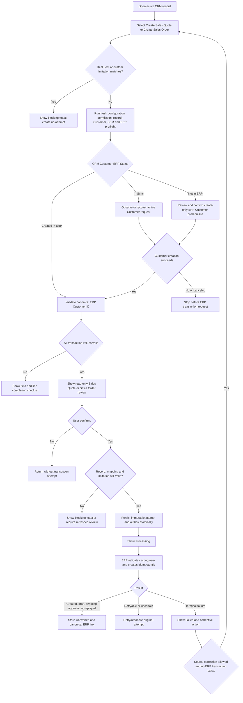

<!-- Source: https://jurnal.atlassian.net/wiki/spaces/ECRM/pages/51342835732/
     Tiny link: https://jurnal.atlassian.net/wiki/x/FIBF9As
     Confluence page ID: 51342835732 · Space: ECRM (ERP CRM)
     Author: Forest Lei · Confluence status: DRAFT — For Product and Tech Review
     Fetched: 2026-09-17 (last modified on Confluence: 2026-09-15)
     This is a local mirror of the CRM "ERP Transaction Conversion Settings V1" PRD
     for reference. Re-fetch from Confluence for the latest. The prototype in THIS
     repo (mekari-erp.vercel.app/crm/...) is cited by the PRD as its design reference.
     Gap analysis vs. the prototype: docs/prd/crm-erp-conversion-settings-gap.md -->

#### **Status: DRAFT — FOR REVIEW**

#### **Release date: TBC**

| Field | Value |
| --- | --- |
| **Status** | Draft — For Product and Tech Review |
| **Author** | Forest Lei |
| **Last updated** | 2026-09-15 |
| **Target release** | CRM V1 / TBC |
| **Surface** | ERP Shell · new CRM Web MFE · new CRM Backend · existing Mekari User Management · existing Quickbook/Jurnal Accounting · existing SCM Core |
| **Platform** | Web and Backend |
| **Related** | [Main CRM platform and Deals V1 PRD](https://jurnal.atlassian.net/wiki/spaces/ECRM/pages/51325763780/PRD+ERP+-+Customizable+CRM+Platform+and+Deals+V1) · [Deals Management V1 PRD](https://jurnal.atlassian.net/wiki/spaces/ECRM/pages/51331269088/PRD+Mekari+ERP+CRM+Deals+Management+V1) · [Custom Module Management and Module Display V1 PRD](https://jurnal.atlassian.net/wiki/spaces/ECRM/pages/51336445984/PRD+Mekari+ERP+CRM+Custom+Module+Management+and+Module+Display+V1) · [Customers and Companies Management V1 PRD](https://jurnal.atlassian.net/wiki/spaces/ECRM/pages/51334611063/PRD+Mekari+ERP+CRM+Customers+and+Companies+Management+V1) |
| **Prototype** | [Fine-tuned Mekari ERP CRM prototype](https://mekari-erp.vercel.app/crm/customers/contacts) |
| **Jira tickets** | To be created after PRD approval |

---

# **PRD: Mekari ERP CRM — ERP Transaction Conversion Settings V1**

## **Background & Product Overview**

### **Background**

Mekari ERP CRM is a metadata-driven customer-facing platform in which Deals and administrator-created custom modules hold operational records before an ERP sales transaction exists. A CRM record may contain a CRM Customer, products, dates, currency, commercial terms, and other information that an authorized user later needs to create as an ERP Sales Quote or Sales Order.

Without a controlled conversion configuration, each CRM module would either require hard-coded transaction logic or force users to re-enter the same information in ERP. Hard-coded conversion would make custom modules ineffective, while unrestricted mapping could create incomplete, unauthorized, duplicated, or financially incorrect ERP transactions.

CRM therefore needs a dedicated **Settings → ERP Integration Settings** surface. It allows an authorized administrator to decide, for every active published module, whether ERP transaction conversion is enabled. When enabled, the administrator selects one supported transaction target, maps every required ERP field to a compatible CRM field or approved default strategy, optionally maps other supported ERP fields, and saves one validated mapping configuration that takes effect for subsequent new conversions.

V1 supports only:

- **Sales Quote**;
- **Sales Order**.

**Expense is not supported in V1.** Condition-based prompts, status-triggered conversion, automatic posting, and other conversion automation are also excluded. Every conversion begins through an explicit manual action on one eligible CRM record, shows a read-only transaction review, and requires final user confirmation.

For Sales Quote and Sales Order, the selected CRM Customer must have a verified canonical ERP Customer ID. The dedicated Customers and Companies PRD is authoritative for this prerequisite. If the Customer is **Not in ERP**, the transaction flow pauses and uses the same reviewed, create-only ERP Customer flow. CRM does not search, match, merge, or link to an existing ERP Customer. The Default Account Receivable account is resolved from ERP Company Settings; it is not configured in CRM ERP Integration Settings.

ERP remains authoritative for Customers created in ERP, transaction numbering, transaction status, approval behavior, accounting rules, taxes, terms, currency rules, custom fields, dimensions, and canonical transaction persistence. SCM remains authoritative for products, SKUs, units, Warehouses, and product eligibility. CRM owns module metadata, CRM records, the current conversion configuration for each module, conversion identities, payload snapshots, status projection, and audit history.

### **Product overview**

The ERP Integration Settings landing page lists active published CRM modules, including the protected Deals system module and all active custom modules. Each row shows whether conversion is enabled, the selected target, mapping readiness, ERP-schema validation status, last update, and a **Manage** action.

Custom modules start with conversion disabled. Deals is provisioned with a protected default Sales Order mapping. That mapping becomes enabled and Ready only when the tenant's current ERP and SCM requirements validate successfully; otherwise Deals shows **Needs attention** until an administrator resolves the configuration and saves it successfully.

Each module may have only one target and one mapping list at a time. Deals and custom modules may use Sales Quote or Sales Order. When conversion is disabled, an administrator may save an incomplete mapping as a draft. When conversion is enabled, **Save changes** validates and directly applies the current mapping to subsequent new conversions; there is no separate Publish step or parallel published mapping. Before saving an enabled configuration, the UI shall explicitly warn that successful changes take effect immediately for future conversions. Disabling or changing a configuration never removes an existing CRM-to-ERP link, mutates a successful ERP transaction, or changes the immutable snapshot of an in-flight attempt.

All ERP fields that are mandatory under the current tenant's Sales Quote or Sales Order contract are always visible in the mapping form. Supported non-mandatory fields are collapsed by default and may be expanded and mapped in the same flow. Optional mappings are not required for configuration completeness; however, when an optional field is mapped, its record value is automatically prefilled in the manual conversion review and submitted to ERP when present and valid.

Mapping supports three V1 source strategies:

1. a compatible CRM module field;
2. a controlled system-derived value, such as confirmed conversion date, company base currency, module record identity, or verified ERP Customer ID; or
3. a fixed, active, same-company ERP reference or target default, such as a payment term, Warehouse, or tax strategy.

V1 does not include formulas, arbitrary transformations, scripting, cross-record calculations, or values entered only inside the final transaction review. Missing record values are corrected on the CRM record. The final review is read-only so the submitted payload has an auditable source and is reproducible.

The ERP schema is tenant-aware. CRM retrieves the current Sales Quote or Sales Order contract, including feature-dependent mandatory custom fields or dimensions. A configuration is Ready only when every current mandatory ERP requirement is supported and mapped. If the ERP contract changes, CRM marks affected configurations **Needs revalidation** and blocks new conversions until the mapping is validated and saved successfully.

At runtime, an authorized user selects **Create Sales Quote** or **Create Sales Order** from a CRM record. CRM first enforces the explicit conversion limitations: a Deal in a **Lost** Stage cannot convert, and a custom-module record cannot convert when its configured blocking criterion evaluates true. The button remains visible in both cases, but clicking it shows a toast explaining that conversion is not allowed and creates no preflight or transaction attempt. Otherwise, CRM checks the current mapping, current record values, field access, Customer prerequisite, SCM references, tenant context, ERP permission, and absence of a prior successful conversion. It then shows the exact values to be submitted. Confirmation creates one durable conversion attempt through a transactional outbox. Quickbook/Jurnal Accounting revalidates the acting user and creates or returns the same ERP transaction idempotently.

One CRM record may create at most one successful ERP transaction in V1, regardless of later target changes, mapping changes, record edits, archive and restore, or module lifecycle changes.

---

## **Product References**

| Reference | Use in this PRD |
| --- | --- |
| [Main CRM platform and Deals V1 PRD](https://jurnal.atlassian.net/wiki/spaces/ECRM/pages/51325763780/PRD+ERP+-+Customizable+CRM+Platform+and+Deals+V1) | Authoritative overall CRM direction, system boundaries, module metadata, authorization foundation, conversion reliability, SCM integration, and non-functional requirements except where this dedicated PRD explicitly narrows V1 conversion scope |
| [Deals Management V1 PRD](https://jurnal.atlassian.net/wiki/spaces/ECRM/pages/51331269088/PRD+Mekari+ERP+CRM+Deals+Management+V1) | Authoritative Deals fields, Product List behavior, commercial calculations, Warehouse behavior, manual conversion, protected fields, and record lifecycle |
| [Custom Module Management and Module Display V1 PRD](https://jurnal.atlassian.net/wiki/spaces/ECRM/pages/51336445984/PRD+Mekari+ERP+CRM+Custom+Module+Management+and+Module+Display+V1) | Authoritative custom-module field catalog, draft/publish lifecycle, field dependencies, module availability, field permissions, Product List configuration, and active/inactive behavior |
| [Customers and Companies Management V1 PRD](https://jurnal.atlassian.net/wiki/spaces/ECRM/pages/51334611063/PRD+Mekari+ERP+CRM+Customers+and+Companies+Management+V1) | Authoritative document structure and Sales Quote/Sales Order ERP Customer prerequisite, including create-only behavior, Default AR resolution, Customer ERP statuses, idempotency, and no matching/linking |
| CRM Settings V1 — Company Profile, Users, and Teams | Authoritative inherited ERP-role ceilings, direct per-user CRM Access, Teams, record scopes, field access, and conversion permissions, as narrowed by this PRD to Sales Quote and Sales Order only |
| Existing Quickbook/Jurnal Sales Quote and Sales Order domains | Authoritative transaction validation, tenant feature settings, required custom fields and dimensions, approval behavior, transaction numbering, canonical persistence, and URLs |
| Existing SCM Core domains | Authoritative product/SKU identity, units, product eligibility, Warehouses, and current validation |
| [Fine-tuned Vercel prototype](https://mekari-erp.vercel.app/crm/customers/contacts) | Visual and interaction reference for ERP Shell, Settings navigation, module integration list, mapping editor, readiness panel, and review dialogs |

This PRD is authoritative for CRM V1 ERP transaction-conversion configuration and runtime behavior. Where referenced documents or the prototype still show **Expense**, an option-field/status prompt, automatic conversion, ERP Customer matching/linking, or a CRM-managed Default Account Receivable setting, this PRD supersedes those conversion-specific details:

- V1 targets are Sales Quote and Sales Order only.
- V1 trigger is manual action only.
- The Deal Lost rule and optional maximum-one custom-module criterion only block an explicit manual action; they never prompt or initiate conversion.
- Expense and all Expense-specific permissions, mappings, APIs, screens, and metrics are deferred.
- ERP Customer handling is create-only, with no Match, Merge, Link, Unlink, or Relink.
- Default Account Receivable remains in ERP Company Settings and is only consumed by the Customer prerequisite.

The fine-tuned prototype remains a design-style reference, not an authoritative source when its displayed product rules conflict with this PRD. No previous Sites prototype is a product source.

---

## **Goals & Objectives**

| Goal | Description |
| --- | --- |
| G1 — Module-level conversion choice | Allow an administrator to explicitly enable or disable ERP transaction conversion for each active published Deals or custom module. |
| G2 — Supported target selection | Allow one enabled Sales Quote or Sales Order target per module while preventing unsupported Expense or multi-target configuration. |
| G3 — Complete, type-safe mapping | Keep every tenant-mandatory ERP field visible and require it to use a compatible CRM field, system-derived value, or approved fixed/default strategy; allow supported optional ERP fields to be expanded and mapped in the same flow. |
| G4 — Reusable configuration for custom modules | Make conversion available to eligible custom modules without hard-coding each module's business process. |
| G5 — Protected Deals behavior | Provide a safe default Sales Order mapping while preserving Deals fields, Product List semantics, Warehouse rules, and protected conversion state. |
| G6 — Manual and reviewed creation | Ensure no Stage, status, option, bulk update, import, API update, or configuration event automatically creates or prompts an ERP transaction in V1. |
| G7 — Customer prerequisite integrity | Prevent Sales Quote or Sales Order creation until the selected CRM Customer has a freshly verified canonical ERP Customer ID through the create-only Customer flow. |
| G8 — ERP contract fidelity | Validate mappings and record payloads against current tenant-specific ERP requirements, business rules, permissions, approval settings, and schema versions. |
| G9 — Exactly-once business outcome | Prevent duplicate ERP transactions under repeated clicks, concurrent confirmation, retry, timeout, worker restart, or lost responses. |
| G10 — Permission-safe conversion | Apply entitlement, tenant, module, record, field, CRM conversion, ERP transaction, Customer, SCM, and acting-user permission checks consistently. |
| G11 — Auditable and recoverable lifecycle | Maintain one current mapping list per module, preserve immutable attempt snapshots and configuration-change audit events, expose safe statuses, and support deterministic retry and reconciliation. |
| G12 — Clear operational readiness | Make missing mappings, stale ERP contracts, invalid references, incomplete records, denied permissions, and integration degradation visible and actionable. |
| G13 — Explicit conversion limitations | Prevent Deals in Lost Stage and custom-module records matching one optional administrator-defined blocking criterion from converting, while keeping the manual action visible with clear feedback. |

### **Non-Goals (for V1)**

- Expense conversion or any Expense beneficiary, GL-account-line, payment-method, pay-from, withholding, or payable-mode mapping.
- Automatic ERP transaction creation.
- Prompting or automatically starting conversion when a Pick List, Radio, Stage, status, date, threshold, report result, or other condition is reached. The Deal Lost restriction and the one custom-module blocking criterion are eligibility checks after a user clicks the manual conversion action; neither initiates conversion.
- A workflow, automation, rules, webhook, or scheduled-conversion builder.
- Bulk Sales Quote or Sales Order conversion.
- More than one enabled transaction target per module.
- More than one successful ERP transaction per CRM record.
- Creating a Sales Order after the same CRM record already created a Sales Quote, or vice versa.
- Updating, voiding, deleting, closing, approving, emailing, printing, or synchronizing an ERP transaction from CRM after creation.
- Pulling ERP transaction edits or statuses back into CRM beyond the canonical creation result and link stored at conversion success.
- ERP Customer search, matching, Merge, Link, Unlink, or Relink.
- A CRM-owned Default Account Receivable setting.
- Runtime-only data entry in the final conversion review.
- Formula expressions, scripts, arbitrary transformations, multi-record aggregation, or cross-module lookup traversal in mappings.
- Mapping a generic CRM Lookup field directly to an arbitrary ERP master ID without an explicit supported reference contract.
- Deposits, price rules, attachment copying, and any ERP field that is not exposed as a supported required or optional field by the V1 target-schema contract.
- Reproducing the full ERP Sales Quote or Sales Order form in CRM.
- Creating or editing CRM modules, fields, Customers, Products, Warehouses, taxes, terms, currencies, or ERP custom fields from ERP Integration Settings.
- A public conversion API for external integrators.
- Configuration history, parallel draft/published mapping lists, or self-service rollback to an earlier mapping.

---

## **Target Users**

| User | Need | Access boundary |
| --- | --- | --- |
| Company Owner / CRM Super Admin | Review every module's conversion readiness and manage conversion configuration | CRM entitlement and inherited ERP role remain required; upstream transaction permission is not automatically granted by CRM configuration access |
| CRM Integration Administrator | Enable/disable conversion, select a target, map required/optional fields and defaults, configure one custom-module blocking criterion, validate, preview, and save | Requires Manage ERP Integration Settings plus module-configuration visibility; cannot view unauthorized record values |
| Module Administrator | Correct module fields and dependencies required by an enabled mapping | Module builder permission does not automatically grant ERP Integration Settings management or record conversion |
| Sales User / Record Owner | Manually create one Sales Quote or Sales Order from an eligible record | Requires module/record access, read access to every mapped source field, target-specific CRM conversion permission, and upstream ERP transaction permission |
| Customer Data Steward | Complete the create-only ERP Customer prerequisite when needed | Requires Customer Edit and upstream ERP Customer Create in addition to transaction-context permissions |
| ERP Approver | Approve or reject the created ERP transaction under existing ERP behavior | Approval occurs in ERP; CRM does not grant or reproduce approval authority |
| Support / SRE Operator | Reconcile uncertain requests, inspect safe failure context, and operate queues | Uses audited operational tooling; cannot change mapping or business data silently |

---

## **Scope**

### **4.1 In Scope (V1)**

#### Conversion settings landing page

- Settings second-level navigation entry named **ERP Integration Settings**.
- Default view containing every active, published Deals or custom module.
- Filters for All, Sales Quote, Sales Order, Disabled, Ready, Needs attention, and Inactive modules where exposed.
- Module type, enablement, target, readiness, ERP schema freshness, last validation, last update, and Manage action.
- Inactive published modules available through a filter with preserved read-only configuration.
- Never-published custom-module drafts excluded.

#### Module conversion configuration

- Enable/disable conversion.
- Exactly one Sales Quote or Sales Order target when enabled.
- Manual action as the only V1 trigger; no trigger selector is shown.
- Mandatory mappings always visible and supported optional mappings collapsed/expandable in the same form.
- CRM field, system-derived, fixed ERP reference, and target-default source strategies.
- ERP-contract refresh, type compatibility, dependency validation, permission summary, record preview, and context-sensitive Save action.
- Protected Deals default mapping and configurable future target.
- One current target and mapping list per module: incomplete draft saving only while Disabled; direct validated application when Enabled.
- An optional maximum-one blocking criterion for each custom module.

#### Mapping and dependency safety

- Stable field, option, module, ERP reference, schema, and mapping identifiers rather than labels.
- Type compatibility and option-to-ERP-value translation where explicitly supported.
- Product List structured mapping.
- Current tenant-mandatory ERP custom fields and dimensions when supported by the V1 adapter.
- Blocking unsupported mandatory ERP requirements with an actionable status.
- Cross-validation with module layout publication, field activation, field type, Product List existence, module lifecycle, and field permissions.
- Schema-drift detection and Needs revalidation state.

#### Manual runtime conversion

- Create Sales Quote or Create Sales Order action on eligible active records.
- Discoverable completion checklist when the module is Ready but the record is incomplete.
- Fresh Customer, SCM, ERP schema, reference, permission, and business-rule preflight.
- Integrated create-only ERP Customer prerequisite.
- Read-only transaction summary.
- Explicit confirmation and cancellation.
- Durable processing, canonical success result, safe failure, retry, and reconciliation.
- Conversion status, linked ERP transaction number/type, canonical ID/URL, and attempt timestamps. Configuration revision/version is not presented on ongoing or converted CRM records.

#### Security, reliability, and operations

- Tenant and acting-user context on every request.
- CRM and ERP authorization intersection.
- Transactional outbox, stable conversion identity, attempt idempotency, immutable payload snapshot, and exactly-once successful result.
- Audit History, permission-filtered Record History, operational telemetry, alerts, and runbooks.
- English and Indonesian localization and WCAG 2.1 AA behavior.

### **4.2 Out of Scope**

All Non-Goals above are out of scope. The following boundary cases are explicitly excluded:

- Expense in the target selector, filters, permissions, APIs, events, readiness references, metrics, or error copy.
- Trigger timing, positive conversion conditions, schedules, automatic confirmation, or auto-post controls. The explicit Deal Lost restriction and optional custom-module blocking criterion are in scope only as manual-action eligibility limitations.
- Conversion actions from List bulk-selection bars, Kanban multi-select, imports, reports, or Audit History.
- One CRM record creating both a Sales Quote and a Sales Order.
- Chaining the created Sales Quote into a Sales Order from CRM.
- Copying ERP approval actions into CRM.
- Allowing a configuration administrator to bypass module-field or record-value permissions through Preview.
- Allowing stale, inactive, unauthorized, archived, deleted, cross-company, or unresolvable references to pass validation.

---

## **Functional Requirements**

### **Settings provisioning, navigation, and authority**

1. **ERP Integration Settings** shall appear under the permanent CRM **Settings** second-level navigation.
2. The route shall be guarded by CRM entitlement, active same-company user context, inherited ERP permission ceiling, and CRM Settings permission.
3. Viewing the integration list and managing integration configuration shall be separate permissions: **View ERP Integration Settings** and **Manage ERP Integration Settings**.
4. Company Owner / CRM Super Admin shall receive both CRM-owned capabilities by default, subject to the inherited ERP-role ceiling.
5. Configuration permission shall not grant module-record access, Customer access, Product access, ERP transaction creation, or ERP approval permission.
6. Direct URLs and APIs shall enforce the same visibility and mutation rules as the visible navigation and controls.
7. The page shall not contain a Default Account Receivable control. Missing Default AR is handled through the Customer prerequisite and links to authorized ERP Company Settings.
8. The page shall not display Expense, trigger timing, prompt conditions, or automatic conversion controls in V1.

### **Module eligibility and list behavior**

1. The default list shall contain exactly one row for every active, published CRM module in the current company.
2. The Deals system module shall appear once and shall be identified as **System module**.
3. Active custom modules shall be identified as **Custom module**.
4. Never-published custom-module drafts shall not appear because no stable runtime record schema exists.
5. Inactive previously published custom modules shall be available through an explicit Inactive filter and shall show preserved configuration as read-only.
6. A module row shall show:
    - module icon and name;
    - module type;
    - conversion state: Enabled or Disabled;
    - target: Sales Quote, Sales Order, or None;
    - readiness;
    - ERP schema status/version where safely displayable;
    - last validated time;
    - last updated actor/time; and
    - Manage or View action.
7. Search shall match module name without revealing modules the viewer is not authorized to configure or inspect.
8. Sort and pagination shall use deterministic module ordering and bounded server pagination when required by entitlement limits.
9. If the ERP schema service is unavailable, the list shall continue to show saved configuration and its last-known validation time with a degraded-state notice.

### **Supported targets and module defaults**

1. V1 shall expose only **Sales Quote** and **Sales Order** as target choices.
2. A module may have zero or one enabled target.
3. Deals may select Sales Quote or Sales Order and shall never select Expense.
4. A custom module may select Sales Quote or Sales Order when its published fields can satisfy the selected target.
5. Custom modules shall begin with conversion Disabled and no active target.
6. Deals shall be provisioned with the protected system Sales Order mapping.
7. The Deals mapping shall become Enabled and Ready only if tenant ERP schema, Customer, Product List, Currency, Warehouse, required dates/defaults, field permissions, and SCM contracts validate.
8. If the initial default-configuration validation fails, Deals shall show **Needs attention**; the action shall remain unavailable until an administrator resolves the configuration and saves it successfully.
9. Target availability shall also reflect company entitlement and existing ERP capability. An unavailable target shall be disabled with a safe reason rather than silently omitted if the user may manage the configuration.
10. Selecting a target shall not create a transaction, modify a module record, or alter a prior conversion.

### **Configuration states and readiness**

| State | Meaning | Runtime behavior |
| --- | --- | --- |
| Not configured | Conversion is Disabled and no target/mapping has been saved | No conversion action |
| Disabled — Incomplete draft | Conversion is Disabled and its one saved mapping is incomplete or has incompatible selections | No conversion action; administrator may continue editing and save while Disabled |
| Disabled — Valid draft | Conversion is Disabled and its one saved mapping passes current validation | No conversion action; administrator may enable and save after fresh validation |
| Ready | Enabled current configuration passes current module, permission, ERP-schema, ERP-reference, and SCM dependency validation | Manual action is visible when the user otherwise has access; record-level limitations are enforced on click |
| Needs revalidation | Enabled current configuration was validated against an older or unconfirmed ERP/module dependency change token | New conversions blocked; existing pending attempts continue under their snapshot |
| Needs attention | A required mapping/reference is missing, incompatible, inactive, unauthorized, unsupported, or broken | New conversions blocked with administrator guidance |
| Module inactive | Previously published custom module is inactive | No runtime action; configuration retained read-only until reactivation |

Requirements:

1. Readiness shall be calculated by the backend and shall not trust client-submitted status.
2. CRM shall persist no more than one conversion configuration and one mapping list for each module.
3. A Ready configuration shall store the validated module change token, ERP schema change token, dependency tokens, current configuration revision, actor, and time.
4. A configuration shall leave Ready when a mandatory dependency changes and compatibility can no longer be proven.
5. Stale status shall not delete the current saved mapping or prior transaction links.
6. Existing durable conversion attempts shall continue to reconcile using their immutable snapshots even if the current configuration becomes Disabled, stale, or changed.

### **Enable and disable conversion**

1. Manage shall expose one **Allow this module to create an ERP transaction** switch or equivalent explicit Enabled/Disabled control.
2. Enabling shall require selecting Sales Quote or Sales Order, completing every mandatory mapping, and passing current validation.
3. An incomplete configuration may be saved only while conversion is Disabled. It is the module's one saved mapping, not a parallel draft beside another live mapping.
4. Disabling shall require confirmation explaining that new Create Sales Quote/Create Sales Order actions will disappear.
5. Disabling shall take effect for subsequent new attempts after bounded cache invalidation.
6. Disabling shall preserve:
    - the module's one current mapping list;
    - prior validation results;
    - module records and protected conversion fields;
    - successful ERP transaction IDs, numbers, types, links, and timestamps;
    - failed and pending attempt history; and
    - audit events.
7. Disabling shall not cancel or erase a Processing or reconciliation-required attempt.
8. Re-enabling shall require validation against the current module and ERP contract, even when a previously valid mapping is retained.
9. Repeated enable/disable requests for the same configuration revision shall be idempotent.
10. While Disabled, **Save draft** may persist an incomplete mapping and shall keep conversion Disabled.
11. While Enabled, the action shall be **Save changes**. Before confirmation, the UI shall warn that a successful save takes effect immediately and affects all subsequent new conversions.
12. Enabling and saving shall be one validated atomic operation. If validation or persistence fails, the previously saved Enabled/Disabled state and mapping remain unchanged.

### **Change transaction target**

1. An administrator may change the target only for future records that have not converted successfully.
2. Selecting a different target changes the editor's unsaved working copy. CRM shall not persist separate target-specific mapping lists.
3. The previous target mapping shall not be retained as a reusable alternative after a successful save. The newly saved target and mappings become the module's only current configuration.
4. Target change shall show an impact summary containing:
    - current target and new target;
    - mappings that can be reused;
    - mappings that become invalid or newly required;
    - affected module fields/defaults;
    - whether current records have pending/failed/successful conversions; and
    - that saving while Enabled directly changes subsequent new conversions.
5. A successful prior conversion shall remain canonical and shall block every later target action for that record.
6. A target change shall not reinterpret or mutate pending, failed, or successful attempt snapshots.
7. If conversion is Enabled, saving a target change shall revalidate the full new target configuration and apply it atomically. If the save fails, the previously saved target and mapping remain active.
8. If conversion is Disabled, the administrator may save an incomplete target mapping as the module's only draft configuration.

### **Configuration data model and single-mapping persistence**

Each conversion configuration shall include at minimum:

| Attribute | Requirement |
| --- | --- |
| Company ID | Derived from trusted tenant context; immutable |
| Module ID/key | Stable CRM module identity; immutable for the module configuration |
| Enabled state | Explicit Boolean with actor/time and revision |
| Target type | `sales_quote` or `sales_order` only |
| Configuration revision | Optimistically locked revision of the one current saved configuration; used for concurrency control, not presented as mapping history on CRM records |
| Validated module change token | Exact module/layout schema state validated with the mapping |
| ERP schema identity/version | Exact tenant target contract used for validation |
| Mapping entries | Target field identity, requirement status, source strategy, source identity, option map/default, and validation result |
| Custom-module blocking criterion | Optional one-field criterion containing stable field ID, supported operator, typed comparison value, and validation result; absent for Deals |
| Dependency snapshot | Customer, Product List, Currency, Warehouse, ERP reference, SCM, custom-field, dimension, and permission dependencies |
| Validation result | Ready/errors/warnings, machine codes, actor, and time |
| Last-save metadata | Actor, time, prior revision, change summary, enabled-at-save state, and idempotency identity |

Requirements:

1. Labels shall be presentation data. Module, field, option, ERP-reference, schema, and target identities shall use stable IDs/keys.
2. Renaming a compatible mapped CRM field or option shall not break the mapping solely because its label changed.
3. Deactivating or type-changing a mapped source shall invalidate or block the dependent configuration.
4. CRM shall maintain exactly one persisted target and mapping list per module; it shall not keep parallel Draft and Published configurations or reusable prior-target mappings.
5. While conversion is Disabled, saving may overwrite the current mapping even when mandatory mappings are incomplete. The saved state shall remain Disabled and be identified as an incomplete or valid draft.
6. While conversion is Enabled, saving shall validate every mandatory mapping for completeness, validate every selected required or optional mapping for type/reference correctness, validate the custom-module blocking criterion when configured, and atomically replace the current saved configuration only on success.
7. Optional mappings shall never be required merely to achieve configuration completeness. An invalid optional mapping that is selected shall still block an Enabled save until corrected or returned to Unmapped.
8. Repeated saves for the same configuration revision and idempotency identity shall return the same result and shall not apply the mutation twice.
9. Audit History shall retain immutable change events and safe before/after deltas, but V1 shall not retain prior mappings as independently selectable or restorable configuration lists.
10. An in-flight conversion attempt shall retain its own immutable payload and mapping-source snapshot for retry/reconciliation; this snapshot is attempt evidence and not a second editable module mapping.

### **Mapping form structure and optional-field behavior**

1. The editor shall retrieve the selected target's current tenant-specific ERP schema before rendering the mapping form.
2. Every always-mandatory and currently applicable tenant-mandatory ERP field shall always be visible in an expanded **Mandatory mappings** section.
3. A conditionally mandatory ERP field shall also remain visible in that section, with its requirement condition explained. It shall count toward completeness whenever the current configuration/tenant condition can require it; an approved target default may satisfy the requirement when the ERP contract allows that strategy.
4. Mandatory fields shall not be hidden by search, progressive disclosure, optional-field expansion, or prior mapping state. Search/filter may highlight or navigate to them but shall not remove them from the form.
5. All non-mandatory ERP fields that the target-schema contract marks as supported shall be available in a collapsed **Optional mappings** section in the same configuration flow.
6. The administrator may expand/collapse the optional section, search optional target fields, map any supported optional field, leave it Unmapped, or return it to Unmapped.
7. The collapsed state is presentation state only. Expanding/collapsing shall not add, remove, save, or change a mapping.
8. Configuration completeness shall count only mandatory and applicable conditionally mandatory fields. An unmapped optional field shall never prevent a Disabled draft save, an Enabled save, or activation.
9. If an optional field is mapped, its mapping shall be validated for source compatibility, permissions, reference validity, and allowed values in the same save and runtime checks as a required mapping. An invalid selected optional mapping shall block saving an Enabled configuration until corrected or set to Unmapped.
10. On manual conversion, CRM shall automatically resolve and prefill every mapped required and optional field from the current CRM record, documented system-derived value, fixed ERP value/reference, or ERP default strategy.
11. A mapped optional source with a present valid value shall appear in the read-only review and be submitted to ERP automatically; the user shall not need to re-enter it.
12. If a mapped optional source is blank, CRM shall omit it or use the explicitly mapped ERP default according to the target contract. Blank optional data shall not block conversion unless the current ERP rule makes the field conditionally mandatory.
13. If a mapped optional value is present but invalid, stale, unauthorized, or rejected by the current ERP contract, preflight shall block conversion and identify the safe target/source field for correction.
14. ERP target fields that are immutable, calculated, unsupported in V1, or not returned as mappable by the target-schema contract shall not appear as selectable optional mappings. Their omission does not affect configuration completeness.

### **Mapping source strategies**

| Source strategy | Examples | Rules |
| --- | --- | --- |
| CRM module field | CRM Customer, Product List, Date, Currency, Decimal, Percentage, Single Line, Multi-Line, Pick List/Radio with explicit option translation | Field must belong to the published source module, be active, type-compatible, and readable by every authorized converter |
| System-derived | Confirmed conversion date, company base currency, verified ERP Customer ID, module record ID, Primary Record Name, current company, acting user | Only documented deterministic system sources are allowed; no arbitrary expression |
| Fixed ERP reference/value | Payment term, Warehouse, tax/default, currency, Boolean mode, finite target option | Must be selected from an authorized tenant-scoped ERP source and remain active/valid at validation and conversion time |
| ERP target default | Current ERP Customer address/default, company transaction default, target-owned numbering, target-owned approval routing | CRM shall show the source as ERP-managed and revalidate it; CRM shall not copy or edit the default |

Requirements:

1. A required target field shall have exactly one active source strategy and shall always remain visible in the Mandatory mappings section.
2. An optional target field may be Unmapped; CRM shall then omit it or allow the documented ERP target default. When mapped, its value shall be automatically resolved and prefilled during manual conversion.
3. Blank, null, inactive, incompatible, unauthorized, or cross-company fixed references shall not count as valid mappings.
4. A CRM field source shall reference one field ID, not a label.
5. A Pick List or Radio used for a finite target enumeration/reference shall provide an explicit option-ID-to-target-ID map for every source option allowed to reach conversion, unless one documented target default covers unmapped options.
6. Free-text values shall not be treated as ERP master IDs.
7. Formula expressions, concatenation, arithmetic, date arithmetic owned by CRM, regular expressions, code, and cross-record traversal shall be rejected in V1.
8. Target-owned default calculations, such as a due date produced from an ERP payment term, remain allowed when the ERP contract owns and validates the calculation.
9. Mapping values shall not be entered or edited in the final conversion review.

### **Field-type compatibility**

| ERP target category | Compatible CRM/system sources | Incompatible examples |
| --- | --- | --- |
| ERP Customer/person | One CRM Customer field resolved to a verified ERP Customer ID | Text, generic Lookup, manually typed ERP ID |
| Product lines | One Product List field | Generic Subform, free-text SKU list, Lookup |
| Date-only | CRM Date or confirmed conversion date/ERP-owned date default | Free text; Date/Time without an approved canonical date projection |
| Text/reference/memo | Primary Record Name, Single Line, Multi-Line, Auto-Number, approved system record identity, fixed text where offered | File/Image binary content, Product List object |
| Email/phone/URL | Same semantic field type or compatible text field with target validation | Numeric/arithmetic field |
| Currency code/strategy | Currency field, company base currency, or fixed supported ERP currency | Unvalidated text currency code |
| Monetary amount | Currency field using the transaction currency; Product List monetary subfield | Binary floating-point value, Percentage without target percentage semantics |
| Decimal/exchange rate | Positive Decimal or fixed positive rate; `1` for base currency | Currency amount, free text, zero/negative value |
| Percentage | Percentage or fixed percentage within target range | Currency amount or unbounded text |
| Boolean | Checkbox or fixed Boolean | Pick List label without explicit option translation |
| Finite ERP option/reference | Fixed active ERP reference; Pick List/Radio with explicit option translation; documented ERP default | Generic CRM Lookup ID, unmapped source label |
| Tenant custom field/dimension | Compatible supported CRM field, fixed allowed ERP value, or explicit option map | Unsupported field type or missing mandatory dimension |

1. Compatibility shall be validated in the backend when saving an Enabled configuration, when activating a Disabled configuration, during explicit validation/preview, and at conversion preflight.
2. The field picker shall show compatible fields first and label incompatible fields with a reason or omit them according to design accessibility guidance.
3. Numeric conversion shall not silently round, truncate, change scale, or change percentage conventions.
4. Date/Time-to-Date conversion is not assumed in V1. If the target contract later approves it, the conversion rule must be deterministic, locale-safe, documented, and represented explicitly in the current mapping before use.
5. A mapped source field shall be readable by every user granted the corresponding module conversion permission. Hidden fields shall not be read through service authority to create a transaction silently.

### **ERP schema discovery and refresh**

1. CRM shall obtain the current same-company Sales Quote and Sales Order field contract from Quickbook/Jurnal Accounting through an internal schema/reference capability.
2. The contract shall distinguish:
    - always required fields;
    - conditionally required fields and their conditions;
    - optional supported fields;
    - immutable target-owned fields;
    - supported defaults;
    - allowed types/options/references;
    - tenant-mandatory ERP custom fields;
    - tenant-mandatory dimensions where applicable;
    - feature/entitlement dependencies; and
    - schema identity/version or equivalent change token.
3. **Refresh ERP fields** shall be a read-only operation and shall never create or update an ERP transaction or reference.
4. Refresh shall update the current editor validation view but shall not silently save or modify mapping choices.
5. CRM shall check schema freshness when saving or activating an Enabled configuration and during every conversion preflight.
6. When the current ERP schema differs from the last validated change token, CRM shall either prove backward compatibility or mark the configuration Needs revalidation.
7. A newly mandatory ERP field shall immediately appear in Mandatory mappings and shall block new conversion until supported, mapped, and saved successfully. A Disabled configuration may still save the incomplete mapping as a draft.
8. If a mandatory requirement uses an unsupported V1 field type or behavior, CRM shall show **Unsupported ERP requirement**, identify the safe field label, and keep the configuration unready without leaking protected schema details.
9. ERP schema outage shall not erase cached metadata or make ordinary CRM records unreadable.

### **Common mapping requirements**

Every enabled target shall define or derive:

| Requirement | Mapping rule |
| --- | --- |
| CRM source identity | Module ID, record ID, Primary Record Name, and current module change token are captured for correlation; Primary Record Name may also map to ERP Reference Number when configured |
| ERP Customer | Exactly one CRM Customer field; runtime value must resolve to one verified same-company ERP Customer ID |
| Transaction date | CRM Date or confirmed conversion date |
| Product lines | Exactly one active Product List field containing at least one valid line |
| Currency | Mapped Currency field, fixed supported currency, or company base currency |
| Exchange-rate strategy | `1` for base currency; otherwise positive mapped/fixed rate or approved ERP-owned rate strategy |
| Due/expiry strategy | Target-specific mapped Date or approved ERP payment-term/validity default |
| Warehouse strategy | Deals protected Warehouse/Product List context, fixed ERP Warehouse, or approved ERP default when target/company/product configuration requires one |
| Tax/discount behavior | Mapped Product List/target fields or approved ERP defaults; calculation order remains ERP-owned |
| Tenant-mandatory fields | Every supported mandatory custom field/dimension has a valid source/default |
| Conversion system fields | Protected status, linked transaction identity, attempt identity, and timestamps are available to CRM runtime; configuration revision/version is not presented on ongoing or converted CRM records |

1. Exactly one CRM Customer field and one Product List field shall be selected for the enabled target.
2. If a custom module contains multiple CRM Customer fields, the administrator shall choose one.
3. A module may contain at most one Product List field under the Custom Module PRD; the mapping shall reference that field.
4. The ERP transaction number shall be generated by ERP and shall not be mapped from CRM.
5. ERP approval routing and initial persisted status shall be determined by current ERP rules and acting-user authority.
6. CRM Deal Value or another summary Currency field shall not override ERP-calculated transaction total. CRM may display it for comparison and warn about a mismatch, while ERP recalculates from submitted lines and target rules.

### **Product List mapping**

1. The administrator shall map the Product List as one structured field; V1 shall not expose arbitrary subfield-to-subfield mapping.
2. CRM shall use the fixed semantic line mapping below:

| Product List value | ERP Sales Quote/Sales Order line |
| --- | --- |
| Canonical SCM SKU/variant/product ID | Product ID |
| Product name/code snapshot | Review display and audit-safe snapshot; canonical ID remains authoritative |
| Line description | Description when present and supported |
| Quantity | Positive transaction quantity |
| Unit ID/snapshot | ERP/SCM-compatible unit ID and display unit |
| Negotiated/original price | Unit rate/price |
| Product discount type/value | Line discount fields under target-supported semantics |
| Tax ID/rate snapshot | Current valid line tax reference and calculated tax inputs under ERP rules |
| Line subtotal | Review comparison only; ERP recalculates canonical amount |
| Warehouse context | Target Warehouse validation where applicable; one Deal-level/fixed Warehouse unless the approved Product List contract supplies one consistent context |

1. Product List shall contain at least one valid line and no more than the approved 100-line V1 limit.
2. Product/SKU/variant ID, unit, eligibility, Warehouse compatibility, sellable status, and tenant ownership shall be freshly validated with SCM before confirmation.
3. Stale/restricted snapshots remain readable on the CRM record but shall not pass conversion.
4. Product-master rows that are not valid sellable transaction identities shall be rejected.
5. Positive quantity and non-negative unit price are required. Discounts shall not reduce a line below zero.
6. Available Stock remains advisory. Insufficient stock alone shall warn but shall not block conversion; an invalid Warehouse/product identity or unavailable mandatory SCM validation shall block.
7. ERP shall remain authoritative for tax calculation, rounding, total, approval, and persistence.
8. Mapping changes shall not rewrite Product List values or SCM masters.

### **Sales Quote mapping requirements**

| ERP field/capability | Requirement | Allowed V1 source/default |
| --- | --- | --- |
| ERP Customer/person | Required | Selected CRM Customer field → verified ERP Customer ID |
| Transaction date | Required | CRM Date or confirmed conversion date |
| Due date | Required strategy | CRM Date or approved ERP term/default |
| Expiry date | Required | CRM Date or approved ERP quote-validity/payment-term default |
| Payment term | Required when target/company contract requires it | Fixed ERP term, Pick List/Radio option map, or ERP Customer/company default |
| Product lines | Required | Fixed semantic mapping from selected Product List |
| Currency | Required | CRM Currency, fixed supported currency, or company base currency |
| Exchange rate | Required for foreign currency | Positive Decimal/fixed rate or supported ERP-owned strategy; `1` for base currency |
| Warehouse | Conditional | Deals/Product List context, fixed Warehouse, or approved ERP default |
| Billing address | Optional/defaultable | ERP Customer current default, compatible CRM text field, or fixed supported value |
| Shipping address | Optional | Compatible CRM text field, ERP Customer default, or omitted |
| Shipping/delivery date | Optional | CRM Date or omitted |
| Ship via | Optional | Compatible text/option mapping or omitted |
| Reference number | Optional | Primary Record Name, Auto-Number, Single Line, or system record identity |
| Line description | Optional | Product List semantic line description |
| Line discount and tax | Optional/conditional | Product List values or ERP defaults |
| Transaction discount | Optional | Currency/Percentage with explicit target mode |
| Tax-inclusive/tax-after-discount flags | Optional/conditional | Checkbox/fixed Boolean or ERP default |
| Shipping fee | Optional | Currency field or fixed zero/non-negative amount |
| Memo/message | Optional | Single Line/Multi-Line or omitted |
| Mandatory ERP custom fields/dimensions | Tenant-dependent required | Compatible supported field/default/option map |

1. Sales Quote shall not be Ready without valid transaction-date, due-date, expiry-date, Customer, Product List, Currency/rate, and every current conditional mandatory strategy.
2. Quote expiry shall be validated against transaction date and ERP rules.
3. ERP transaction number, status, approval, and canonical total shall not be mapped from CRM.
4. Every non-mandatory Sales Quote field returned as supported and mappable by the V1 target-schema contract, including supported optional ERP custom fields, shall appear in the collapsed Optional mappings section. Unsupported types/capabilities shall be identified safely and are not mappable; attachments and other binary fields remain unsupported unless the schema contract explicitly adds a compatible V1 source.

### **Sales Order mapping requirements**

| ERP field/capability | Requirement | Allowed V1 source/default |
| --- | --- | --- |
| ERP Customer/person | Required | Selected CRM Customer field → verified ERP Customer ID |
| Transaction date | Required | CRM Date or confirmed conversion date |
| Due date | Required strategy | CRM Date or approved ERP term/default |
| Payment term | Required when target/company contract requires it | Fixed ERP term, Pick List/Radio option map, or ERP Customer/company default |
| Product lines | Required | Fixed semantic mapping from selected Product List |
| Currency | Required | CRM Currency, fixed supported currency, or company base currency |
| Exchange rate | Required for foreign currency | Positive Decimal/fixed rate or supported ERP-owned strategy; `1` for base currency |
| Warehouse | Conditional | Deals/Product List context, fixed Warehouse, or approved ERP default |
| Billing address | Optional/defaultable | ERP Customer current default, compatible CRM text field, or fixed supported value |
| Shipping address | Optional | Compatible CRM text field, ERP Customer default, or omitted |
| Shipping/delivery date | Optional | CRM Date or omitted |
| Ship via/tracking reference | Optional | Compatible text/option mapping or omitted |
| Reference number | Optional | Primary Record Name, Auto-Number, Single Line, or system record identity |
| Line description | Optional | Product List semantic line description |
| Line discount and tax | Optional/conditional | Product List values or ERP defaults |
| Transaction discount | Optional | Currency/Percentage with explicit target mode |
| Tax-inclusive/tax-after-discount flags | Optional/conditional | Checkbox/fixed Boolean or ERP default |
| Shipping fee | Optional | Currency field or fixed zero/non-negative amount |
| Memo/message | Optional | Single Line/Multi-Line or omitted |
| Mandatory ERP custom fields/dimensions | Tenant-dependent required | Compatible supported field/default/option map |

1. Sales Order shall not be Ready without valid Customer, transaction date, due-date/term strategy, Product List, Currency/rate, Warehouse where required, and every current conditional mandatory strategy.
2. Every non-mandatory Sales Order field returned as supported and mappable by the V1 target-schema contract, including supported optional ERP custom fields, shall appear in the collapsed Optional mappings section. Unsupported types/capabilities shall be identified safely and are not mappable; attachments and other binary fields remain unsupported unless the schema contract explicitly adds a compatible V1 source.
3. The created Sales Order shall be standalone. CRM shall not create or depend on a Sales Quote chain source.
4. ERP transaction number, approval routing, fulfillment state, WMS dispatch, payment state, and canonical total shall not be mapped from CRM.

### **Deals default mapping**

1. Deals shall use its protected Customer, Product List, Currency, Exchange Rate, Warehouse, Primary Record Name/Reference Number, and conversion system fields.
2. The system default target shall be Sales Order.
3. The system shall preconfigure deterministic safe defaults where available:
    - transaction date = confirmed conversion date;
    - ERP Customer = Deal Customer's verified ERP Customer ID;
    - product lines = Deal Product List semantic mapping;
    - currency = Deal Currency or company base currency;
    - exchange rate = Deal Exchange Rate or `1` for base currency;
    - Warehouse = Deal Warehouse or a validated target-owned default where allowed;
    - reference = Deal Reference Number when present, otherwise a documented Deal identity strategy; and
    - dates/terms/tax/discount/shipping = mapped Deal fields or current approved ERP defaults.
4. Administrators may change the future target to Sales Quote and update allowed mappings/defaults.
5. Administrators shall not remove or deactivate protected fields required by the enabled Deals conversion.
6. Deals conversion remains manually available at any valid non-archived Stage except **Lost**; Stage change never prompts or creates a transaction.
7. For a Deal in a Stage whose canonical Stage classification is **Lost**, the configured **Create Sales Quote** or **Create Sales Order** button shall remain visible to an otherwise authorized user.
8. Clicking the conversion button for a Lost Deal shall show a localized toast such as **“This Deal cannot be converted because its Stage is Lost.”** CRM shall not open the review, create a preflight/Customer prerequisite request, enqueue an event, or create an ERP transaction.
9. The Lost restriction shall use the protected canonical Stage classification/ID rather than a translated or administrator-edited label. It shall be rechecked by the backend on click and again at confirmation to prevent stale-client bypass.
10. For an unconverted Lost Deal with an Enabled Ready configuration and valid user access, the limitation check shall take precedence over record-data completeness: the button remains clickable and returns the Lost toast even if other mapped values are incomplete. It does not override archive, prior-success, module, entitlement, or permission rules.
11. Won classification shall not block conversion and shall not automatically enable, prompt, or submit conversion. Existing Deal Stage rules remain independently authoritative.
12. Deal Expected Value is not the ERP transaction total. The review may show a comparison warning when it differs from the ERP-calculated preview.

### **Custom-module mapping readiness**

1. A custom module shall be eligible only after it has an active published version.
2. For Sales Quote or Sales Order, the module shall contain:
    - Primary Record Name system field;
    - at least one active CRM Customer field;
    - one active Product List field; and
    - every additional CRM field required by the selected mapping strategy.
3. Missing capabilities shall be listed with a direct **Open module builder** action when the administrator may configure the module.
4. ERP Integration Settings shall not create, move, rename, activate, or edit CRM module fields directly.
5. A module builder publication that would remove, deactivate, type-change, hide from all converters, or otherwise invalidate the current Enabled mapping or blocking-criterion field shall be blocked until the dependency is resolved or conversion is disabled.
6. Newly required module fields do not backfill existing records. Existing records remain readable and expose a completion checklist before conversion.
7. Custom-module Product List restrictions and snapshots shall follow the Custom Module and Deals PRDs.

### **Custom-module conversion limitation criterion**

1. ERP Integration Settings shall offer custom modules an optional **Block conversion when** setting. Deals shall not show this setting because Deals use the fixed Lost Stage restriction.
2. V1 shall allow a maximum of one blocking criterion for each custom module configuration.
3. The criterion shall contain exactly one CRM field, one supported operator, and one typed comparison value:
    - **Equals** — allowed for supported scalar text, option, Boolean, number, and date/date-time field types; Pick List/Radio comparison shall store the stable option ID rather than its label; or
    - **Contains** — allowed only for Single Line, Multi-Line, Email, Phone, or URL text values and evaluated as a case-insensitive substring after the documented whitespace normalization.
4. CRM Customer, Product List, generic Lookup, File/Image, formula/script output, and protected conversion system fields shall not be selectable for the criterion.
5. The setting shall be absent by default. An administrator may add one criterion, edit it, or remove it; the UI shall not offer an AND/OR group, a second condition, nested logic, a positive allow condition, or an automatic trigger.
6. A configured criterion is complete only when field, operator, and comparison value are present and type-compatible. An incomplete criterion may be saved only while conversion is Disabled.
7. When conversion is Enabled, saving or activating shall validate the criterion's field existence, active state, type, stable option/value identity, and criterion-field read-permission coverage for authorized converters. A validation failure shall leave the previously saved Enabled configuration unchanged.
8. Renaming the criterion field or option shall preserve the criterion when the stable identity and type remain compatible. Removal, deactivation, incompatible type change, or option deletion shall make the Enabled configuration Needs attention and block conversion until corrected and saved, or until conversion is disabled.
9. The backend shall evaluate the criterion using the latest persisted CRM record value when the user clicks the manual conversion button and shall re-evaluate it during confirmation.
10. If the criterion evaluates **true**, the conversion button shall remain visible to an otherwise authorized user. Clicking it shall show a localized toast such as **“This record cannot be converted because it matches the module’s conversion limitation.”** CRM shall not open the review, start the Customer prerequisite, persist a conversion attempt, enqueue an event, or create an ERP transaction.
11. For an unconverted matching record with an Enabled Ready configuration and valid user access, the limitation check shall take precedence over record-data completeness: the button remains clickable and returns the limitation toast even if other mapped values are incomplete. It does not override archive, prior-success, module, entitlement, or permission rules.
12. The blocking toast shall not reveal a hidden field value or inaccessible configuration detail. Where the user may view the criterion field, the UI may include the safe field label and configured limitation summary.
13. If the criterion evaluates **false**, conversion proceeds through the ordinary fresh preflight. A blank value does not match **Equals** or **Contains** unless an explicit blank operator is added in a later PRD; no such operator exists in V1.
14. Editing a record so the criterion changes from false to true or true to false shall never prompt or start conversion. The criterion is checked only in response to the explicit manual conversion action and final confirmation.

### **Mapped-field permission requirements**

1. A mapped CRM field source or custom-module limitation-criterion field in an Enabled configuration shall be readable by every user granted that module's corresponding conversion action.
2. Saving or activating an Enabled configuration shall validate the effective intersection of inherited ERP role ceiling, direct CRM Access, module availability, record scope, action permission, and field access.
3. A configuration shall not use service authority to read a field that is Hidden from the acting converter and silently include it in the ERP payload.
4. Read-only CRM fields may be mapped and submitted when the user can read them and the conversion permission authorizes the transaction action.
5. General record Edit is not required solely to submit conversion; however, Edit is required to correct a missing record value.
6. If an unlinked Customer must be created in ERP, Customer Edit and upstream ERP Customer Create are additionally required.
7. Configuration Preview shall use placeholders or omit values when the administrator lacks access to the selected sample record or source fields.
8. A later permission change that makes a mapped field unreadable to an authorized converter shall make that user's action unavailable. If no authorized converter can read a required mapping, the configuration shall become Needs attention.

### **Save, validate, preview, and apply**

1. A module shall have one saved conversion configuration and one mapping list. The editor may hold an unsaved working copy in the browser, but CRM shall not persist a parallel Draft and Published configuration.
2. While conversion is Disabled, **Save draft** shall persist the one current mapping even when mandatory mappings or the optional custom-module limitation criterion are incomplete. It shall not make a conversion action available.
3. While conversion is Enabled, the primary action shall be **Save changes**, not Publish. Selecting it shall show a confirmation explaining that a successful save directly affects all subsequent new conversions.
4. **Discard unsaved changes** shall restore the one current saved configuration in the editor. It shall not restore an older mapping or create another saved list.
5. Leaving with unsaved changes shall show Stay and Leave actions.
6. **Validate** shall perform read-only checks and shall never create an ERP Customer or transaction. It may be used before Save but does not apply changes.
7. Validation shall check:
    - company/module identity and lifecycle;
    - target availability and entitlement;
    - current module version and mapped-field existence/type;
    - source-strategy completeness and option maps;
    - the custom-module limitation criterion when configured;
    - converter field-read compatibility;
    - CRM Customer and Product List capabilities;
    - current ERP schema and mandatory fields/dimensions;
    - active same-company fixed ERP references;
    - SCM Product List/Warehouse contract compatibility; and
    - unsupported/deferred feature usage.
8. Validation errors shall be grouped by Mandatory mapping, Optional mapping, Conversion limitation, Module field, Permission, ERP requirement, Customer prerequisite, Product List/SCM, and Target default.
9. Each error shall have a stable machine code, localized safe message, and actionable link where the user is authorized.
10. Completeness validation shall require only mandatory and applicable conditionally mandatory ERP fields. Optional fields may remain Unmapped; a selected optional mapping must still be valid.
11. Warnings may allow an Enabled save only when they do not make a mandatory or selected optional ERP payload invalid or weaken authorization/idempotency.
12. Preview may use one authorized sample record to show a read-only mapped payload. When no authorized sample is selected, Preview shall show source strategies and placeholders.
13. Preview shall label ERP-owned defaults, omitted optional fields, prefilled mapped optional fields, stale values, limitation results, warning conditions, and canonical recalculation boundaries.
14. Preview shall not expose hidden record values, create a Customer, reserve stock, calculate approval as guaranteed, or create a transaction.
15. Saving or activating an Enabled configuration shall revalidate the latest editor revision against the current module, ERP schema, references, permissions, mandatory mapping completeness, every selected optional mapping, and the configured limitation criterion.
16. A successful Enabled save shall atomically overwrite the module's one current configuration, set it Ready, invalidate relevant readiness/action caches, and affect only new conversions started after the save.
17. An Enabled save failure or optimistic-concurrency conflict shall leave the previously saved active configuration unchanged and keep the user's unsaved working copy available for correction/reload.
18. A successful Disabled draft save shall atomically overwrite the one current Disabled configuration without requiring mandatory completeness.
19. Updated behavior shall become available to new conversions within one minute of a successful Enabled save under healthy dependencies.

### **Module and dependency changes after configuration save**

1. CRM shall continuously or periodically detect relevant module, permission, ERP schema, ERP reference, and SCM dependency changes.
2. Renaming fields/options while retaining stable compatible identities shall not invalidate mapping.
3. Removing/deactivating/type-changing mapped or limitation-criterion fields shall be blocked by module publication while conversion is enabled, unless an atomic replacement configuration is included through an approved orchestration.
4. Deactivating Product List or CRM Customer shall be blocked while required by enabled conversion.
5. Archiving a fixed ERP reference, removing target entitlement, or adding a mandatory unsupported ERP requirement shall mark the configuration Needs attention or Needs revalidation.
6. Deactivating a custom module shall remove runtime conversion actions but retain configuration and links.
7. Reactivating a module shall require current validation before actions return.
8. A dependency change shall never mutate a previously submitted payload or successful ERP transaction.

### **Runtime action visibility and eligibility**

**Create Sales Quote** or **Create Sales Order** shall be evaluated for one record and one acting user.

The action may appear only when:

1. the CRM company entitlement is active;
2. the source module is active, published, and available to the user;
3. conversion is Enabled with one Ready current target;
4. the user can view the source record within Own, Own Teams, or All scope;
5. the user can read every mapped CRM source field;
6. CRM Access grants the matching Create Sales Quote or Create Sales Order action;
7. the acting user has the corresponding upstream ERP permission;
8. the record is not archived;
9. no successful ERP transaction exists for the record conversion identity; and
10. no Processing or unresolved reconciliation attempt blocks a new confirmation.

Additional requirements:

1. The backend shall run the Deal/custom-module limitation gate before the full record-data completeness preflight. A matched limitation keeps the button clickable and returns its toast; when no limitation matches, an incomplete record shall keep the action discoverable in a disabled/attention state with **Complete required information**.
2. The checklist shall identify safe field labels and sections and link to Edit when authorized.
3. If the user cannot edit, the checklist shall explain that an authorized user must complete the record without exposing hidden values.
4. Stage, Status, Pick List, Radio, Kanban move, bulk update, import, and API record update shall never prompt or automatically start conversion.
5. For Deals, Lost Stage shall not hide the action from an otherwise authorized user. Clicking the visible action shall show the Lost restriction toast and stop before downstream preflight.
6. For a custom-module record matching its configured blocking criterion, the action shall remain visible to an otherwise authorized user. Clicking it shall show the limitation toast and stop before downstream preflight.
7. The backend shall enforce both limitation checks; UI visibility and toast behavior are not the security or data-integrity boundary.
8. An archived record, inactive module, Disabled configuration, stale configuration, denied permission, or prior success shall not expose a usable conversion action.

### **Record preflight validation**

Before the transaction review, CRM shall validate fresh data rather than trusting list/detail snapshots:

1. trusted company, entitlement, user, and module context;
2. active source module, current module change token, and current configuration revision;
3. source record identity, version, archive state, and conversion state;
4. acting-user module, record, field, conversion, and upstream ERP permissions;
5. Deal Stage is not Lost, or the configured custom-module blocking criterion evaluates false, as applicable;
6. every effective conditional-layout requirement applicable to the record;
7. one active, same-company, authorized CRM Customer;
8. verified ERP Customer prerequisite state or eligibility to start the create-only prerequisite;
9. at least one valid Product List line and current SCM product/unit eligibility;
10. Warehouse/default validity when required;
11. transaction date, due/expiry strategy, payment term, Currency, Exchange Rate, discounts, taxes, shipping, reference, and every mapped optional value;
12. current target ERP schema, mandatory custom fields/dimensions, reference validity, and feature settings;
13. target-specific value ranges, date relationships, string lengths, decimal precision, and allowed options;
14. absence of a successful ERP transaction for the record conversion identity; and
15. absence of a conflicting active/uncertain attempt.

Validation errors shall be grouped by record section and Product List line. They shall point to the source CRM field where possible. Validation shall not persist a conversion request or change Conversion Status.

### **ERP Customer prerequisite**

The Customers and Companies PRD is authoritative. The transaction flow shall implement:

1. The configured CRM Customer field must contain one active, authorized, same-company Customer.
2. If ERP Status is **Created in ERP**, CRM shall freshly validate the stored canonical ERP Customer ID and continue.
3. If ERP Status is **In Sync**, CRM shall attach to or observe the active Customer creation request and shall not create another Customer or transaction.
4. If ERP Status is **Not in ERP**, CRM shall pause transaction conversion and open the canonical reviewed ERP Customer creation step.
5. The Customer creation step shall:
    - require Customer Edit and upstream ERP Customer Create;
    - resolve the current Default Account Receivable from ERP Company Settings;
    - show the mapped Customer payload and one-time create-only explanation;
    - never search the ERP Customer population;
    - never offer Merge, Link, Unlink, or Relink; and
    - use its own Customer-scoped idempotency identity.
6. Customer cancellation or failure shall stop the transaction flow before an ERP transaction request exists.
7. A duplicate ERP Customer Name shall return the Customer to Not in ERP and block conversion with safe guidance to edit the CRM Customer; it shall not expose or link the conflicting ERP Customer.
8. After verified Customer creation, CRM shall preserve the ERP Customer ID, automatically resume fresh transaction preflight, and then show the Sales Quote/Sales Order review.
9. Successful Customer creation remains valid if the user later cancels the transaction review or the transaction fails.
10. Transaction confirmation shall revalidate the ERP Customer ID so a stale frontend cannot bypass the prerequisite.
11. Customer creation and transaction creation shall use separate idempotency identities linked by one immutable conversion correlation.

### **Read-only conversion review**

1. Passing preflight shall open **Create Sales Quote** or **Create Sales Order** review.
2. The review shall show, when applicable and authorized:
    - source module, record name, and record reference;
    - target type;
    - ERP Customer identity that will be used;
    - transaction date and due/expiry date;
    - payment term/default source;
    - Currency and Exchange Rate;
    - Warehouse/default source;
    - Product List lines with product, SKU/code, quantity, unit, unit price, discount, tax, and amount preview;
    - transaction discount, tax behavior, shipping fee, and expected calculated total;
    - billing/shipping address strategy;
    - reference number, memo, message, and other supported optional mappings;
    - mandatory ERP custom fields/dimensions;
    - every configured optional ERP field whose mapped value will be submitted;
    - advisory stock or CRM Deal Value comparison warnings;
    - ERP-owned numbering, approval, and recalculation notice.
3. The review shall be read-only. It shall not contain editable transaction fields.
4. A user needing to correct data shall return to Edit record. Returning to review shall run fresh preflight.
5. Cancellation shall create no transaction attempt and shall leave Conversion Status unchanged.
6. Review data shall be permission-filtered and shall not display a hidden source field.
7. The review shall explain that ERP owns the canonical total, numbering, status, and approval result.

### **Confirmation and processing**

1. Selecting **Create Sales Quote** or **Create Sales Order** in the review shall be the final explicit transaction confirmation.
2. Confirmation shall recheck record version, current configuration revision and mapping fingerprint, Customer ID, permissions, target schema, limitation result, and conversion state.
3. If any value changed after review, CRM shall stop and require the user to review the refreshed payload.
4. Successful confirmation shall atomically persist:
    - stable record conversion identity;
    - immutable attempt version and idempotency key;
    - source module/record/version;
    - immutable mapping-source snapshot/fingerprint used to build the payload;
    - ERP schema version;
    - acting user and record owner identities;
    - verified ERP Customer ID;
    - immutable mapped payload snapshot;
    - safe dependency snapshot; and
    - transactional outbox event.
5. Conversion Status shall change to **Processing** after the durable request is committed.
6. Repeated/concurrent confirmation of the same reviewed version shall return the same attempt and shall not create another outbox event or ERP transaction.
7. A worker shall invoke Quickbook/Jurnal Accounting using service authentication plus explicit tenant, acting-user, target, conversion identity, and idempotency context.
8. Service authentication shall never replace the acting user's ERP business permission.
9. ERP shall apply current transaction validation, approval, numbering, and accounting behavior and shall atomically persist the idempotency identity with the transaction result.
10. A persisted ERP draft or awaiting-approval transaction shall count as conversion success.

### **Conversion status and record projection**

Conversion-enabled modules shall expose protected read-only system information:

| Field/state | Behavior |
| --- | --- |
| Conversion Status | Not converted, Processing, Converted, or Failed |
| Linked ERP Transaction Type | Sales Quote or Sales Order after verified success |
| Linked ERP Transaction Number | Canonical ERP-generated number after verified success |
| Linked ERP Transaction ID/URL | Canonical same-company ERP identity and authorized link |
| Last Attempt | Safe timestamp and status/error category |

Requirements:

1. These fields shall be system-managed, read-only, and protected from deactivation/type change once introduced.
2. List/detail may render **Needs attention** as a presentation status for failed/incomplete behavior without adding an unsupported persisted conversion state.
3. Processing may internally include queued, retrying, or reconciliation-required substates while user copy remains safe and understandable.
4. CRM shall not set Converted without a verified canonical ERP transaction ID, type, and number/link result.
5. Converted is terminal for CRM V1 and shall never return to Not converted, Processing, or Failed.
6. Opening the ERP link shall recheck current ERP access and shall not assume the original converter still has permission.
7. Conversion success shall not automatically change Deal Stage or any custom-module field.
8. Configuration revision, mapping version, mapping fingerprint, and schema version shall not be shown in the ongoing or Converted CRM record card, record fields, status pill, or ordinary Record History. Authorized operational audit/support tooling may retain internal correlation metadata.

### **Success, failure, retry, and reconciliation**

1. On success, CRM shall store the canonical ERP transaction identity, type, number, URL, persisted/approval state, creation time, and replay indicator; Conversion Status becomes Converted.
2. On a user-correctable preflight failure, no attempt is created and Conversion Status remains Not converted.
3. On a terminal failure after confirmation, Conversion Status becomes Failed with a safe error category, correlation reference, and corrective action.
4. Retryable transport/service failures shall use bounded exponential backoff and the same immutable attempt snapshot and ERP idempotency key.
5. An uncertain result after a possible ERP commit shall enter reconciliation. CRM shall not send a new create request until the existing idempotency result is resolved.
6. Reconciliation shall query or replay by the persistent idempotency identity, not by Customer name, transaction number guess, or general transaction search.
7. If ERP returns the original transaction for a replay, CRM shall record success without creating a duplicate.
8. If a terminal business rejection requires source-data correction and ERP definitively created no transaction, an authorized user may edit the CRM record and confirm a new attempt version under the same stable record conversion identity.
9. A new corrected attempt shall use a new attempt idempotency key while the stable record conversion identity continues to enforce at most one successful ERP transaction.
10. A new corrected attempt shall be blocked while an earlier attempt is Processing or unresolved.
11. Technical **Retry** shall replay the original snapshot. **Review corrected record** shall run a new preflight and confirmation; the UI shall distinguish these actions.
12. Mapping changes after confirmation shall not change an existing attempt snapshot.
13. Worker restart, duplicate delivery, timeout, and concurrent user actions shall not create a duplicate ERP transaction.
14. Dead-lettered or stale Processing attempts shall be alertable and traceable through safe operational tooling.

### **Conversion cardinality and target changes after success**

1. The stable record conversion identity shall be unique for one company, module, and CRM record.
2. At most one ERP Sales Quote or Sales Order may be linked to that identity.
3. After success, neither changing the module target nor editing/restoring the record shall expose a second conversion action.
4. CRM shall not offer Create Sales Order from a record that already created a Sales Quote, or Create Sales Quote from a record that already created a Sales Order.
5. Creating a downstream Sales Order from an ERP Sales Quote is an ERP action outside CRM V1.
6. Archive/restore and module deactivate/reactivate shall preserve the successful link and terminal state.

### **Manual-only invariant**

1. V1 shall not store a trigger mode beyond the fixed system value `manual` if a backend field is operationally required.
2. No trigger selector or positive prompt-condition field shall appear in UI or public/internal configuration payloads except as a fixed read-only manual marker where technically necessary.
3. The Deal Lost restriction and custom-module **Block conversion when** criterion are negative eligibility gates only. They shall never start conversion, open a conversion prompt/review, enqueue a request, or create an ERP transaction.
4. Stage, Status, Pick List, Radio, date, amount, report, workflow, webhook, import, bulk update, or API record changes shall not start conversion, open a prompt, enqueue a request, or create an ERP transaction.
5. Notifications shall relate only to a user-initiated attempt's processing result or required recovery, not to record conditions becoming true.
6. Any future prompt or automation capability requires a later approved PRD and migration of the configuration contract.

### **Error, empty, and degraded states**

| State | Required experience |
| --- | --- |
| No active published modules | Explain that modules must be published and active; link to Modules when authorized |
| All conversions disabled | Show module rows with Disabled/Not configured states and Manage actions |
| Mapping incomplete | List missing mandatory target fields and compatible-source guidance; Save draft remains available only while conversion is Disabled |
| Unsupported mandatory ERP field | Block readiness, show safe field requirement and escalation guidance |
| ERP schema unavailable | Show cached status and last validation; block enabling, Enabled save, and conversion when freshness cannot be proven |
| SCM unavailable | Keep saved records/configuration readable; block mandatory product/Warehouse validation with Retry |
| Customer prerequisite blocked | Link to Customer correction or ERP Company Settings when authorized; create no transaction request |
| Permission denied | Hide or disable action according to discoverability policy; never reveal hidden field/value details |
| Stale module/configuration revision | Reject mutation and reload the latest single saved configuration while preserving the user's unsaved working copy where feasible |
| Record changed after review | Close/refresh review and require confirmation of the new payload |
| Processing | Show durable progress and prevent duplicate submission |
| Failed | Show safe category and either technical Retry or Review corrected record |
| Reconciliation required | Explain that result is being verified; prevent new attempt; provide support correlation |
| Converted | Show target, canonical number, and authorized ERP link; no new conversion action |

1. Errors shall preserve valid administrator draft input and valid CRM record data.
2. Safe messages shall support English and Indonesian and shall not expose raw upstream payloads, stack traces, internal URLs, credentials, hidden fields, or inaccessible ERP records.
3. Loading, empty, error, retry, stale, conflict, and success states shall be keyboard and screen-reader accessible.

---

## **API Documentation**

### **Internal API Requirements**

Exact paths and wire schemas shall be finalized in technical design. The following logical capabilities are mandatory.

| API capability | Purpose | Required contract behavior |
| --- | --- | --- |
| Integration module list | Return active/inactive published modules and conversion summary | Tenant-scoped, permission-filtered, server-paginated, no draft-only modules |
| Integration configuration detail | Return the module's one current target, mapping list, optional custom-module limitation, dependencies, validation, enabled state, and permission summary | Stable IDs, no unauthorized record values, optimistic revision; no parallel draft/published lists |
| ERP target schema | Return Sales Quote/Sales Order required/conditional/optional fields, references, feature rules, custom fields, dimensions, and version | Read-only, same-company, cache-versioned, safe labels, no Expense schema through CRM V1 |
| Mapping options | Return compatible module fields, system sources, fixed ERP references/defaults, and incompatibility reasons | Type-aware, permission-aware, stable identities, bounded search |
| Save configuration | Overwrite the module's one current configuration | Disabled save may remain incomplete with no runtime effect; Enabled save/activation requires full validation, applies atomically to new conversions, uses optimistic concurrency/idempotency, and preserves prior active state on failure |
| Discard unsaved changes | Reload the one current saved configuration | Client/editor action only; does not restore a historical mapping |
| Validate configuration | Validate mappings and limitation criterion against current module/ERP/SCM/permission dependencies | No Customer/transaction creation, stable machine errors, warnings, change-token result |
| Preview configuration/record | Return strategy-only or authorized sample-record payload preview | Read-only, masked when needed, includes prefilled mapped optional fields and limitation outcome, no side effect, ERP-calculation boundary identified |
| Disable/re-enable conversion | Change enabled state while preserving history | Confirmation revision, no cancellation of pending attempts, idempotent, audited |
| Record conversion eligibility | Return action visibility, checklist, permission/dependency reasons, and current status | Viewer-context authorization, no hidden-field leakage, fresh state |
| Transaction preflight/review | Build an exact Sales Quote/Sales Order preview for one record | Fresh module/config/schema/Customer/SCM/ERP checks, no durable transaction attempt |
| ERP Customer prerequisite | Invoke/observe canonical create-only Customer flow | Dedicated Customer contract, separate idempotency, no ERP search/match/link |
| Confirm conversion | Persist attempt/payload snapshot and enqueue outbox | Compare-and-set state, record/config/schema change-token and limitation checks, idempotent concurrent confirmation |
| Conversion status | Return Processing/Converted/Failed projection and safe attempt details | Permission-filtered, canonical result required for success, polling/event support |
| Retry original attempt | Replay one retryable immutable attempt | Same attempt ID and ERP idempotency key; no new payload |
| Start corrected attempt | Create a new attempt version after definitive terminal failure | Fresh preflight/review/confirmation, new attempt key, same stable record identity, prior success guard |
| Reconciliation | Resolve uncertain ERP outcome by idempotency identity | No general search, no duplicate resend, operator-observable |
| Authorized ERP link | Resolve/open canonical created transaction | Current ERP permission rechecked; no stale blind redirect |
| History/audit | Return permission-filtered record events and authoritative admin events | Immutable event IDs, pagination, field/value minimization |

API requirements:

1. Company ID shall be derived from trusted authentication/company context and shall not be accepted as authoritative browser input.
2. Every ID supplied by a caller shall be validated for same-company ownership and expected resource type.
3. Mutating configuration and conversion APIs shall use idempotency keys where replay could apply a save twice or duplicate an attempt, event, or transaction.
4. Configuration save and record confirmation shall require optimistic revision/ETag or equivalent compare-and-set semantics.
5. A conversion confirmation shall fail if the record, configuration, Customer association, or ERP schema changed after review.
6. ERP schema and reference APIs shall return stable change tokens or versions sufficient to detect stale validation.
7. APIs shall use stable machine error codes plus localized safe messages.
8. Pagination, mapping option search, configuration size, Product List lines, attempts, and retry limits shall be bounded and documented.
9. Internal events shall omit complete transaction payloads, Notes, personal contact data, credentials, and idempotency secrets.
10. CRM shall not write Quickbook database tables directly.
11. The ERP adapter shall invoke existing Sales Quote/Sales Order domain behavior rather than reproducing accounting rules in CRM.
12. No V1 endpoint shall accept `expense`, trigger conditions, automatic posting, or a second successful target for one record.
13. The configuration API may accept only the documented maximum-one `block_conversion_when` criterion for custom modules. It shall reject the field for Deals, additional criteria, positive-trigger semantics, unsupported operators/types, or criteria that attempt to initiate conversion.

### **Integration Ownership**

| System | Ownership and required contribution |
| --- | --- |
| CRM frontend | Settings list/editor, mapping UX, compatibility/readiness, sample preview, runtime action/checklist, Customer prerequisite orchestration UX, read-only review, processing/result/retry states, and authorized links |
| CRM backend | One current module integration configuration/mapping list, validation orchestration, limitation evaluation, dependency tracking, conversion identity/attempts, immutable attempt snapshots, protected status projection, outbox, reconciliation, history, and audit |
| ERP Shell | Authentication/company context, CRM entitlement, route registration/guarding, MFE loading, Settings navigation, and authorized cross-product links |
| Mekari User Management / authorization | User identity, active state, company membership, inherited ERP role ceilings, and acting-user permission context |
| CRM Contacts | CRM Customer identity, ERP Status, verified ERP Customer ID, create-only prerequisite, Default AR consumption from ERP Company Settings, and Customer idempotency |
| SCM Core | Product/SKU/variant identity, units, eligibility, Product Categories/restrictions, Warehouses, and fresh conversion validation |
| Quickbook/Jurnal Accounting | Target schema/reference metadata, ERP Customer/transaction business rules, target permission, tenant features, required custom fields/dimensions, defaults, idempotent Sales Quote/Sales Order creation, approval, numbering, canonical result/URL, and replay/reconciliation support |
| CRM Audit/observability platform | Immutable administrative events, telemetry, dashboards, alerts, safe correlation, retention, and operational runbooks |

Quickbook/Jurnal Accounting shall:

1. Expose current same-company Sales Quote/Sales Order schema and mandatory requirement metadata through an approved internal contract.
2. Expose authorized active references/defaults needed by mapping without leaking inaccessible transaction data.
3. Continue to own transaction validation, tax/discount calculation, dates/terms, currency behavior, numbering, approval, and canonical persistence.
4. Validate the acting user's target-specific transaction permission in addition to service authentication.
5. Accept a persistent CRM conversion-attempt idempotency identity and atomically associate it with the created transaction.
6. Return the original canonical transaction on idempotent replay.
7. Return stable transaction ID, type, number, URL, persisted/approval state, safe error code, and replay indicator.
8. Support deterministic recovery for a lost response without requiring general transaction search.
9. Reject unsupported/cross-company Customer, product, Warehouse, tax, term, currency, custom-field, or dimension references.
10. Not expose Expense through this CRM V1 integration contract.

---

## **Product Design**

The [fine-tuned Vercel prototype](https://mekari-erp.vercel.app/crm/customers/contacts) is the visual and interaction reference. Product Design shall align final screens with this PRD whenever prototype content differs. Specifically, final V1 screens shall remove the Expense choice, trigger timing and prompt condition, create-or-link language, and CRM Default Account Receivable card.

### **Information architecture and routes**

| Surface | Canonical logical route | Primary action |
| --- | --- | --- |
| ERP Integration Settings list | `/v3/crm/settings/erp-integrations` | Review module readiness or Manage |
| Module integration configuration | `/v3/crm/settings/erp-integrations/:moduleId` | Save draft while Disabled; Validate, Preview, or Save changes while Enabled |
| Inactive module configuration | Same detail route with inactive state | View preserved configuration |
| CRM record Detail | Existing module record route | Create Sales Quote or Create Sales Order |
| Conversion review | Record-scoped dialog/drawer or typed nested route | Confirm ERP transaction |
| Conversion status/result | Record Detail conversion card and activity/status surface | Open ERP transaction, Retry, or review failure |

Exact gateway prefixes may be finalized in technical design without changing the information architecture.

### **ERP Integration Settings list**

The page shall contain:

1. Page title and description explaining that administrators choose whether each module can manually create one ERP Sales Quote or Sales Order.
2. Search by module name.
3. Filters for target, Enabled/Disabled, readiness, and Active/Inactive.
4. Optional read-only degraded banner when ERP schema freshness cannot be checked.
5. Table columns:
    - Module;
    - Type;
    - Conversion;
    - ERP transaction type;
    - Mapping readiness;
    - ERP contract status;
    - Last validated/updated; and
    - Manage/View.
6. Status labels communicated by text/icon and not color alone.
7. No Default Account Receivable card, Expense filter, Trigger timing column, or Refresh action that mutates configuration.
8. A page-level **Refresh ERP fields** may perform only the documented read-only schema refresh and shall show completion/failure time.

### **Module integration editor**

Recommended layout:

1. Header with module name, module type, current Enabled/Disabled state, readiness, and Back to all integrations.
2. **1. Conversion**:
    - Allow this module to create an ERP transaction;
    - transaction target: Sales Quote or Sales Order;
    - manual-only information notice; and
    - current entitlement/target availability.
3. **2. Mandatory mappings** — always visible and expanded:
    - ERP target field;
    - purpose/requirement condition;
    - source strategy;
    - CRM field/default selection;
    - compatibility status; and
    - error/warning.
4. **3. Optional mappings** — collapsed by default, expandable within the same form through **Show optional fields** / **Hide optional fields**, searchable, and supporting explicit Unmapped/ERP default states. The section header shall show mapped/available counts without requiring expansion.
5. **4. Conversion limitation** — custom modules only; optional one-field **Block conversion when** criterion with Equals or supported Contains behavior. Deals instead display a read-only notice that Lost Stage blocks conversion.
6. **5. Readiness and dependencies** side panel containing module capabilities, ERP schema change token/freshness, mandatory mapping count, optional mapping count, Customer/Product List requirements, permission coverage, fixed-reference state, limitation validity, and missing/unsupported items.
7. **6. Validation and preview** summary with optional authorized sample-record selector.
8. Sticky footer actions:
    - while Disabled: Discard unsaved changes, Save draft, Validate, and Preview; or
    - while Enabled: Discard unsaved changes, Validate, Preview, and Save changes.
9. Enabling/Save changes remains blocked until current validation passes. Its confirmation dialog shall state that successful changes apply directly to subsequent new conversions.

There shall be no Trigger timing or Prompt condition section.

### **Mapping row experience**

Each mapping row shall:

1. identify Required, Conditional, or Optional;
2. explain the ERP purpose and condition;
3. allow one source strategy;
4. filter compatible CRM fields and show their section/type;
5. identify System-derived, Fixed ERP reference, and ERP default values clearly;
6. support explicit option translation when required;
7. show Compatible, Missing, Incompatible, Stale, Unavailable, Permission conflict, or Unsupported;
8. provide a direct module-builder or ERP Settings link only when the actor is authorized;
9. preserve selection when a label changes but stable identity remains; and
10. remain keyboard and screen-reader operable.

Mandatory rows shall always be rendered in the expanded Mandatory mappings section. Optional rows shall use the same mapping component and validation behavior when expanded; collapsing the section shall not change saved optional mappings.

### **Readiness panel**

The panel shall summarize:

- enabled/disabled state;
- selected target;
- required mappings complete/total;
- optional mappings count;
- module change token/freshness;
- ERP schema change token/freshness;
- CRM Customer and Product List readiness;
- mapped-field permission coverage;
- fixed/default reference validity;
- SCM dependency status;
- unsupported tenant requirements; and
- last validation actor/time.

The panel shall distinguish administrator configuration problems from record-specific incompleteness.

### **Validation and preview experience**

1. Validate shall show progress without implying an ERP transaction is being created.
2. For a Disabled configuration, passing validation shall show **Ready to enable**. For an Enabled unsaved working copy, it shall show **Ready to save**; the saved configuration remains Ready until Save changes succeeds.
3. Failure summary shall group errors and move focus to the first invalid group while allowing navigation to every item.
4. Preview without a record shall show mapping sources and placeholders.
5. Preview with an authorized record shall show a masked/read-only payload using current values and clear ERP-recalculation notices.
6. Preview shall offer no Create/Submit action.
7. A stale result shall identify which dependency changed and require Validate again.

### **Record conversion card and action**

Record Detail may show an **ERP transaction** card with:

- Not configured/Disabled when appropriate for administrators;
- Complete required information checklist;
- Create Sales Quote or Create Sales Order manual action;
- Processing state and correlation-safe progress;
- Failed state with Retry or Review corrected record; and
- Converted state with type, number, created time, and Open in ERP.

The card and ordinary Record History shall not show configuration revision/version or mapping fingerprint for Processing, Failed, or Converted records.

The action shall not appear as a prompt after Stage or option changes. List and Kanban may show status pills but shall not provide bulk conversion. An otherwise authorized user shall still see the action on a Lost Deal or a custom-module record matching its blocking criterion; clicking it shows the relevant localized toast and does not open the review.

### **Customer prerequisite experience**

The transaction flow shall reuse the Customers and Companies PRD design:

1. Created in ERP → validate Customer ID and continue.
2. In Sync → show/observe Customer progress and continue only after success.
3. Not in ERP → show integrated one-time ERP Customer creation review.
4. Missing/invalid Default AR → link to ERP Company Settings; no CRM AR control.
5. Duplicate ERP Customer Name → offer Edit CRM customer and Close; no Merge or Link.
6. Successful Customer creation → return to the originating transaction flow with valid context preserved.

### **Manual conversion experience**

### **Common states**

- Skeleton/loading for list, editor, schema, validation, preview, preflight, and status.
- Empty active modules.
- No configured conversions.
- Disabled.
- Disabled with incomplete draft.
- Disabled with valid draft.
- Needs revalidation.
- Needs attention.
- Unsupported ERP requirement.
- Module inactive.
- Record incomplete.
- Deal Lost limitation matched.
- Custom-module limitation matched.
- Customer prerequisite blocked/in progress/succeeded.
- ERP/SCM degraded.
- Stale editor/record conflict.
- Review changed and refresh required.
- Processing/retrying/reconciling.
- Failed user-correctable, authorization, business, or technical.
- Converted with authorized ERP link.

---

## **User Stories**

| Area | Story | User story | Acceptance criteria | Notes |
| --- | --- | --- | --- | --- |
| Settings navigation | Open ERP Integration Settings | As an authorized administrator, I want one settings area for module conversions so that I can understand company readiness. | **AC#1 Entry:** GIVEN View ERP Integration Settings THEN the Settings item is visible. **AC#2 Guard:** GIVEN direct route/API use THEN entitlement, tenant and permission checks apply. **AC#3 No access:** GIVEN permission denial THEN no configuration metadata is returned. **AC#4 V1 scope:** GIVEN the page loads THEN only Sales Quote and Sales Order concepts appear. **AC#5 No AR:** GIVEN the page loads THEN no Default AR setting appears. | Prototype layout may be reused after conflicting content is removed. |
| Module list | Review module conversion readiness | As an administrator, I want every active published module listed so that I can identify enabled and blocked configurations. | **AC#1 Rows:** GIVEN active published Deals/custom modules THEN each appears once. **AC#2 Draft excluded:** GIVEN never-published custom draft THEN it does not appear. **AC#3 Inactive:** GIVEN inactive published module THEN it is available through an Inactive filter with preserved read-only configuration. **AC#4 Columns:** GIVEN a row THEN type, enablement, target, readiness and validation time are shown; no configuration version appears. **AC#5 Degraded:** GIVEN ERP schema outage THEN saved status remains visible with freshness warning. | No trigger-timing column. |
| Enablement | Enable or disable conversion | As an administrator, I want an explicit yes/no choice per module so that only approved modules can create ERP transactions. | **AC#1 Default:** GIVEN a new custom module THEN conversion is Disabled. **AC#2 Enable:** GIVEN valid target and complete mandatory mappings THEN Save and Enable validates and activates atomically. **AC#3 Incomplete:** GIVEN missing mandatory mapping THEN Save draft is allowed only while Disabled. **AC#4 Enabled save:** GIVEN conversion is Enabled THEN Save changes warns that success directly affects subsequent new conversions. **AC#5 Failure:** GIVEN Enabled save fails THEN the prior saved configuration remains active. **AC#6 Disable:** GIVEN confirmation THEN new runtime actions disappear. **AC#7 Preserve:** GIVEN disable THEN the one mapping list, attempts, links and audit remain. **AC#8 Pending:** GIVEN an existing Processing attempt THEN disable does not erase or duplicate it. | Re-enable requires fresh validation. |
| Target selection | Choose Sales Quote or Sales Order | As an administrator, I want one supported target per module so that the conversion payload has one unambiguous contract. | **AC#1 Options:** GIVEN target selection THEN only Sales Quote and Sales Order appear. **AC#2 One target:** GIVEN enablement THEN exactly one is active. **AC#3 Deals:** GIVEN Deals THEN either target is allowed but Expense is not. **AC#4 Custom:** GIVEN a custom module THEN either target requires compatible capabilities. **AC#5 Impact:** GIVEN target change THEN reusable/new/invalid mappings are summarized. **AC#6 No mutation:** GIVEN target change THEN previous conversions and attempts remain unchanged. | One record cannot later use the other target after success. |
| Mapping | Map mandatory and optional target fields | As an administrator, I want compatible source strategies so that mandatory ERP fields are complete and optional ERP data can also be prefilled. | **AC#1 Visibility:** GIVEN the editor loads THEN every mandatory/applicable conditionally mandatory target field is always visible in the expanded Mandatory mappings section. **AC#2 Optional:** GIVEN supported non-mandatory ERP fields THEN they are collapsed by default but expandable and mappable in the same flow. **AC#3 Strategies:** GIVEN mapping THEN CRM field, system-derived, fixed ERP reference/value, and ERP default are the only V1 choices. **AC#4 Completeness:** GIVEN an Enabled save/activation THEN completeness checks only mandatory fields; optional fields may remain Unmapped. **AC#5 Optional validity:** GIVEN an optional mapping is selected THEN it must be compatible and valid. **AC#6 Prefill:** GIVEN manual conversion and a mapped optional value is present THEN CRM prefills it in review and submits it automatically. **AC#7 IDs/options:** GIVEN rename or finite options THEN stable identities and explicit option IDs are used. **AC#8 No formula:** GIVEN expression/script/cross-record mapping THEN backend rejects it. | A blank optional value is omitted/defaulted unless the ERP rule makes it mandatory. |
| Product List | Map product lines semantically | As an administrator, I want one Product List mapping so that line items reach ERP without configuring every subfield manually. | **AC#1 Field:** GIVEN Sales target THEN exactly one Product List is required. **AC#2 Fixed map:** GIVEN mapping THEN product ID, quantity, unit, price, description, discount and tax use fixed semantics. **AC#3 Lines:** GIVEN no line or more than 100 THEN record cannot convert. **AC#4 Freshness:** GIVEN stale/restricted product or invalid unit/Warehouse THEN preflight blocks. **AC#5 Stock:** GIVEN insufficient Available Stock alone THEN warning appears but conversion is not blocked. **AC#6 Total:** GIVEN CRM subtotal/Deal Value THEN ERP recalculates canonical total. | SCM remains authoritative. |
| ERP schema | Refresh and satisfy tenant requirements | As an administrator, I want current ERP requirements so that the saved active mapping does not omit mandatory tenant fields. | **AC#1 Refresh:** GIVEN Refresh ERP fields THEN no ERP write or automatic configuration save occurs. **AC#2 Dynamic:** GIVEN mandatory custom field/dimension THEN it appears in the always-visible Mandatory section when supported. **AC#3 Optional:** GIVEN supported non-mandatory field THEN it appears in the expandable Optional section. **AC#4 Stale:** GIVEN schema change THEN affected configuration is revalidated or marked stale. **AC#5 Unsupported:** GIVEN unsupported mandatory requirement THEN readiness is blocked with safe guidance. **AC#6 Outage:** GIVEN ERP unavailable THEN cached configuration remains readable but freshness-dependent enable/save/conversion is blocked. | Schema version/change token is required internally. |
| Permissions | Validate converter field access | As an administrator, I want permission conflicts identified before an Enabled save so that conversions do not submit hidden fields. | **AC#1 Coverage:** GIVEN mapped field THEN every target-authorized converter must be able to read it. **AC#2 Hidden:** GIVEN acting user cannot read it THEN payload does not silently include it. **AC#3 Read-only:** GIVEN read-only access THEN conversion may use the value. **AC#4 Correction:** GIVEN missing value and no Edit THEN user is told an authorized editor is required. **AC#5 Preview:** GIVEN admin lacks sample-record access THEN values are masked/placeholders. | Backend authorization is authoritative. |
| Configuration lifecycle | Save, validate, preview, and apply | As an administrator, I want one predictable mapping so that I know when changes affect users. | **AC#1 Single list:** GIVEN a module THEN CRM maintains only one saved target/mapping list. **AC#2 Disabled draft:** GIVEN conversion is Disabled THEN Save draft may persist an incomplete mapping with no runtime action. **AC#3 Validate:** GIVEN Validate THEN module/ERP/SCM/permission/criterion checks run without creating records or applying changes. **AC#4 Preview:** GIVEN Preview THEN required and selected optional values are read-only and no write occurs. **AC#5 Enabled warning:** GIVEN Enabled Save changes THEN confirmation states success directly affects subsequent new conversions. **AC#6 Atomic:** GIVEN validation and save succeed THEN the one configuration is replaced atomically. **AC#7 Conflict/failure:** GIVEN stale revision or save failure THEN prior active configuration remains and unsaved work can be corrected/reloaded. **AC#8 No history:** GIVEN save success THEN no parallel published list or self-service rollback is created. | In-flight attempts continue with their immutable snapshot. |
| Dependencies | Protect the current Enabled mapping | As a module administrator, I want dependency impact shown so that module changes do not silently break conversion. | **AC#1 Field removal:** GIVEN mapped or limitation-field removal/deactivation/type change THEN module publication is blocked while conversion depends on it. **AC#2 Rename:** GIVEN stable identity and compatible rename THEN mapping/criterion survives. **AC#3 Module inactive:** GIVEN deactivation THEN action disappears and configuration is preserved. **AC#4 Reactivate:** GIVEN reactivation THEN fresh validation is required. **AC#5 Prior attempts:** GIVEN dependency change THEN submitted snapshots and successful ERP transactions do not change. | Conversion may be disabled to release a dependency. |
| Action | Manually start conversion | As an authorized CRM user, I want to manually create the configured ERP target so that I control when the transaction is submitted. | **AC#1 Manual:** GIVEN eligible record THEN explicit Create Sales Quote/Create Sales Order is available. **AC#2 No prompts:** GIVEN Stage/status/option changes THEN no prompt or transaction starts. **AC#3 Permission:** GIVEN missing CRM or ERP target permission THEN action is unavailable. **AC#4 Prior success:** GIVEN Converted THEN no second action appears. **AC#5 Incomplete:** GIVEN Ready config but incomplete record THEN action shows a completion checklist and cannot submit. **AC#6 Archive:** GIVEN archived record/inactive module THEN action is unavailable. **AC#7 Limitation visibility:** GIVEN Lost Deal or matching custom-module limitation and otherwise authorized user THEN the action remains visible. | Limitations are enforced on click by the backend. |
| Conversion limitation | Block an explicitly ineligible record | As an administrator, I want narrow conversion limitations so that disallowed records cannot be manually converted. | **AC#1 Deal Lost:** GIVEN Deal Stage classification is Lost WHEN action is clicked THEN a Lost-specific toast appears and no downstream preflight/attempt starts. **AC#2 Custom maximum:** GIVEN custom-module settings THEN zero or one Block conversion when criterion may be configured. **AC#3 Operators:** GIVEN criterion THEN Equals is available for supported scalar fields and Contains only for supported text fields. **AC#4 Match:** GIVEN criterion evaluates true WHEN action is clicked THEN a limitation toast appears and no downstream preflight/attempt starts. **AC#5 No match:** GIVEN false result THEN ordinary preflight continues. **AC#6 Freshness:** GIVEN click and confirmation THEN the backend evaluates the latest record value. **AC#7 Manual only:** GIVEN field/Stage changes THEN no conversion prompt or attempt starts. | The custom toast does not reveal hidden values. |
| Customer prerequisite | Resolve Customer before a sales transaction | As a converter, I want CRM to create the Customer in ERP when required so that the transaction has a canonical customer. | **AC#1 Created:** GIVEN Created in ERP THEN stored ID is freshly validated. **AC#2 In Sync:** GIVEN active Customer request THEN conversion observes it without duplication. **AC#3 Not in ERP:** GIVEN Not in ERP THEN create-only review opens. **AC#4 No matching:** GIVEN Customer review THEN no ERP search, Merge or Link appears. **AC#5 AR:** GIVEN Customer creation THEN Default AR comes from ERP Company Settings. **AC#6 Failure/cancel:** GIVEN Customer fails/cancels THEN no transaction request is created. **AC#7 Resume:** GIVEN Customer succeeds THEN transaction preflight resumes. | Customer and transaction use separate idempotency identities. |
| Preflight | Validate current record and upstream data | As a converter, I want precise validation before review so that I can correct invalid information without creating a failed ERP request. | **AC#1 Fresh:** GIVEN action starts THEN current module/config/record/Customer/SCM/ERP states are checked. **AC#2 Lines:** GIVEN invalid product/quantity/unit/price/tax/Warehouse THEN error points to the line. **AC#3 Dates/currency:** GIVEN invalid dates/rate/term/default THEN target field/source is identified. **AC#4 Mandatory:** GIVEN missing tenant field/dimension THEN review is blocked. **AC#5 No request:** GIVEN any preflight error THEN no conversion attempt exists. **AC#6 Security:** GIVEN hidden field/record THEN errors do not reveal its value. | Validation groups link to record sections. |
| Review | Review the exact transaction payload | As a converter, I want a read-only summary so that I understand what ERP will receive. | **AC#1 Content:** GIVEN preflight passes THEN Customer, dates, terms, currency/rate, Warehouse, lines, adjustments, optional mappings and ERP-owned behavior are shown. **AC#2 Read-only:** GIVEN review THEN no field is editable. **AC#3 Correction:** GIVEN user returns to Edit THEN review reruns on return. **AC#4 Changed:** GIVEN record/config/schema changed THEN old review cannot confirm. **AC#5 Cancel:** GIVEN cancel THEN no transaction attempt is created. **AC#6 Total:** GIVEN total shown THEN ERP recalculation is explicit. | Values remain permission-filtered. |
| Confirmation | Create one durable transaction attempt | As a converter, I want confirmation to be safe under retries so that repeated actions cannot duplicate an ERP transaction. | **AC#1 Atomic:** GIVEN confirmation THEN snapshot, identity and outbox commit atomically. **AC#2 Status:** GIVEN commit THEN Processing is visible. **AC#3 Concurrent:** GIVEN repeated/concurrent confirm THEN same attempt is returned. **AC#4 Context:** GIVEN worker call THEN tenant and acting-user context are included. **AC#5 ERP auth:** GIVEN service credential but denied user permission THEN ERP rejects creation. **AC#6 Snapshot:** GIVEN later mapping/edit THEN in-flight payload remains unchanged. | Final ERP creation is always user-confirmed. |
| Result | Show canonical success | As a converter, I want the resulting ERP transaction link so that I can continue work in ERP. | **AC#1 Success:** GIVEN ERP created/draft/awaiting approval/replayed result THEN Converted is stored. **AC#2 Identity:** GIVEN success THEN type, canonical ID, number, URL, state and time are retained. **AC#3 No version UI:** GIVEN Processing or Converted record THEN no configuration revision/version is shown. **AC#4 Link:** GIVEN Open in ERP THEN current ERP permission is rechecked. **AC#5 Terminal:** GIVEN Converted THEN no later action can create another target. **AC#6 No field mutation:** GIVEN success THEN Deal Stage/custom-module fields do not change automatically. | ERP owns subsequent transaction lifecycle. |
| Recovery | Retry or correct a failed attempt | As a converter or operator, I want failures recovered without duplication so that uncertain outcomes remain trustworthy. | **AC#1 Technical retry:** GIVEN retryable error THEN same snapshot/key is replayed. **AC#2 Uncertain:** GIVEN possible ERP commit THEN reconciliation occurs before resend. **AC#3 Replay:** GIVEN original exists THEN it is returned as success. **AC#4 Terminal correction:** GIVEN ERP definitively created nothing THEN user may correct record and confirm a new attempt version. **AC#5 Guard:** GIVEN prior active/uncertain attempt THEN corrected attempt is blocked. **AC#6 Stable cardinality:** GIVEN multiple failed attempts THEN at most one may ever succeed. | Retry and Review corrected record are distinct actions. |
| V1 boundary | Exclude Expense and automation | As a product owner, I want V1 scope enforced consistently so that delivery does not silently expand. | **AC#1 UI:** GIVEN any CRM conversion screen THEN Expense and positive trigger-condition controls are absent. **AC#2 API:** GIVEN Expense/automatic trigger payload THEN backend rejects it; only the maximum-one custom blocking criterion is accepted. **AC#3 Permissions:** GIVEN CRM Access THEN no Create Expense capability appears for this V1 feature. **AC#4 Events:** GIVEN record changes THEN no conversion prompt/event is emitted. **AC#5 Metrics:** GIVEN reporting THEN conversion metrics contain Sales Quote/Sales Order only. | Blocking criteria affect eligibility only and never initiate conversion. |

---

## **General — User Management**

Effective access is the intersection of:

1. current-company CRM entitlement;
2. active Mekari user and company membership;
3. inherited ERP role permission ceiling;
4. direct CRM Access enabled;
5. module lifecycle and Company-wide/Selected Teams availability;
6. source-record scope: Own, Own Teams, or All;
7. mapped field access;
8. target-specific CRM conversion permission;
9. corresponding upstream ERP transaction permission;
10. CRM Customer permissions when Customer creation is required; and
11. SCM/ERP reference permissions where applicable.

### CRM Access list

| Permission area | V1 capabilities |
| --- | --- |
| ERP Integration Settings | View, Manage |
| Module conversion | Create Sales Quote, Create Sales Order, Retry failed conversion |
| Deferred/absent | Create Expense |
| Source record | View within Own/Own Teams/All; Edit only when correcting record values |
| Mapped fields | Read required for every submitted CRM field; Hidden is never submitted for that user |
| Customer prerequisite | Transaction conversion permission plus Customer Edit and upstream ERP Customer Create when Customer is Not in ERP |
| ERP transaction | Existing upstream Sales Quote or Sales Order Create permission; ERP approval remains separate |
| ERP links | Current upstream ERP view permission at open time |

Authorization rules:

1. View ERP Integration Settings does not grant Manage.
2. Manage ERP Integration Settings does not grant module field-edit, record-view, conversion, Customer, Product, Warehouse, or ERP transaction permission.
3. A configuration administrator may validate metadata without personally having target Create permission, but sample-record Preview remains limited by record/field access.
4. Create Sales Quote and Create Sales Order are distinct CRM permissions and shall be available only for modules whose current Enabled target matches.
5. Retry failed conversion permits technical replay only when the user also retains source-record and matching ERP target permission.
6. Starting a corrected attempt requires the same permissions as a new manual conversion.
7. There is no Create Expense permission in this V1 conversion scope. Existing source documents and access screens shall be aligned before launch.
8. A source-record View user without conversion permission may see a permission-safe Converted result when the record layout allows it, but shall not start/retry conversion.
9. A converter does not require general record Edit solely because CRM writes protected conversion status fields.
10. Frontend visibility is not a security boundary; backend and ERP authorization remain authoritative.
11. Permission changes apply to subsequent requests after bounded cache invalidation and shall be rechecked at preflight, confirmation, worker execution, retry, and ERP-link opening.

---

## **General — Activity Log and Record History**

CRM shall record immutable administrative events for:

| Event | Required context |
| --- | --- |
| `erp_conversion_configuration_saved` | Company, module, target, Enabled/Disabled state, prior/new optimistic revision, actor, changed mapping identifiers, mandatory/optional mapped counts, limitation-present indicator, timestamp; no full mapped values |
| `erp_conversion_configuration_save_failed` | Module, target, Enabled/Disabled intended state, attempted revision, safe validation/conflict/error categories, actor, timestamp |
| `erp_conversion_unsaved_changes_discarded` | Module, target, actor, timestamp; client/editor event only where product analytics policy permits |
| `erp_conversion_validation_started` / `completed` | Module, target, module/schema change tokens, actor, result counts/categories, duration |
| `erp_conversion_previewed` | Module, target, actor, strategy-only/sample mode, authorized record identity when applicable; no full payload |
| `erp_conversion_enabled` / `disabled` | Module, target, current revision, actor, reason/source, timestamp |
| `erp_conversion_target_changed` | Module, prior/new target, prior/new revision, actor, timestamp |
| `erp_conversion_limitation_changed` | Custom module, criterion added/changed/removed, stable field/operator identifiers, actor, timestamp; comparison value minimized or redacted according to sensitivity policy |
| `erp_conversion_limitation_blocked` | Source module/record, target, actor, safe reason `deal_lost` or `custom_criterion_matched`, timestamp; no hidden field value |
| `erp_conversion_marked_stale` / `needs_attention` | Module, current revision, safe dependency category, detected time |
| `erp_conversion_preflight_started` / `blocked` / `passed` | Source module/record, target, actor, internal configuration revision/schema change token, safe result categories |
| `erp_customer_prerequisite_started` / `blocked` / `passed` | Source record, CRM Customer, target, correlated Customer request, verified ERP Customer ID when passed |
| `erp_conversion_review_opened` / `canceled` | Source record, target, actor; no full payload or configuration version in Record History |
| `erp_conversion_confirmed` | Stable conversion identity, attempt version, source record/version, target, actor, internal mapping fingerprint/schema change token, idempotency identity reference |
| `erp_conversion_processing` | Attempt, outbox/event correlation, processing transition/time |
| `erp_conversion_succeeded` | Attempt, target, canonical ERP ID/number, persisted/approval state, replay indicator, completion time |
| `erp_conversion_failed` | Attempt, safe error code/category, retryable/terminal classification, timestamp |
| `erp_conversion_retried` | Attempt, actor/system source, attempt count, same-snapshot marker |
| `erp_conversion_reconciliation_started` / `completed` | Attempt, safe prior/outcome state, operator/system source, timestamp |
| `erp_conversion_corrected_attempt_confirmed` | Stable conversion identity, prior failed attempt, new attempt version, actor, internal mapping fingerprint/schema change token |
| `erp_conversion_link_opened` | Source record, ERP transaction ID/type, actor, authorized outcome; subject to audit policy |
| `crm_access_changed` | Actor, affected user, module, Sales Quote/Sales Order/Retry permission changes |

Record History is a permission-filtered user-facing projection and may show the manual request, processing, success, failure, retry, limitation block, and authorized ERP link. It shall not show configuration revision/version or mapping fingerprint on ongoing or converted CRM records. CRM Audit History is the authoritative administrative log and may retain internal correlation metadata for authorized support.

History, audit, telemetry, and general logs shall not expose:

- service credentials, authorization tokens, request headers, or idempotency secrets;
- complete ERP Customer or transaction payload snapshots;
- hidden CRM field names/values when their identities would reveal restricted information;
- Product List commercial details beyond the authorized user-facing surface;
- Customer email, phone, address, Notes, or other personal data unless the specific authorized surface requires it;
- inaccessible ERP transaction/Customer identities; or
- raw upstream stack traces or database information.

---

## **Compliance & Privacy Requirements**

- Every configuration, mapping, validation, preview, conversion identity, attempt, Customer prerequisite, Product reference, ERP reference, transaction result, and audit event shall be tenant-scoped.
- Backend authorization shall run before configuration metadata, mapping options, record values, previews, errors, histories, or transaction links are returned.
- Service authentication shall not replace acting-user authorization in CRM, SCM, or ERP.
- Preview and review shall minimize Customer, address, contact, Product List, and commercial information to the fields needed for the authorized action.
- Complete immutable payload snapshots shall be encrypted at rest, accessible only to the conversion worker and approved support controls, and retained/deleted according to approved finance/integration policy.
- General application logs and analytics shall contain identifiers and safe categories rather than full payloads or personal data.
- Errors shall not reveal hidden CRM records/fields, inaccessible ERP Customers/transactions, cross-company references, internal account data, or tenant configuration belonging to another company.
- Customer creation shall remain one-way and create-only; no matching/linking or ongoing synchronization is implied.
- Transaction conversion shall create a new ERP document only after explicit user confirmation. CRM shall not update the ERP document afterward.
- Idempotency and reconciliation controls shall prevent duplicate ERP financial documents under retry, timeout, concurrency, and worker recovery.
- Configuration and conversion audit events shall be immutable and retained according to Mekari policy.
- User-facing configuration labels, validation, checklists, review, errors, status, notification, and support copy shall support English and Indonesian.
- Settings tables, mapping controls, dialogs, status changes, errors, and read-only review shall meet WCAG 2.1 AA and be keyboard operable.

---

## **Non-Functional Requirements**

| Area | Requirement |
| --- | --- |
| Settings performance | Integration module list and configuration metadata API p95 ≤ 1.0 second under the approved pilot profile, excluding an explicit live ERP schema refresh |
| Mapping options | Compatible CRM-field and fixed-reference search p95 ≤ 700 ms excluding client debounce and healthy upstream reference latency |
| Validation | Configuration validation p95 ≤ 5 seconds under healthy ERP/SCM dependencies and supported mapping limits |
| Runtime preflight | Conversion preflight/review preparation p95 ≤ 3 seconds under healthy dependencies, excluding Customer creation |
| Result visibility | Conversion success or failure becomes visible within one minute under healthy worker/upstream conditions |
| Reliability | The current saved configuration and confirmed attempts survive process/worker restart; outbox, retry, dead-letter, and reconciliation prevent silent loss |
| Consistency | One current configuration is saved atomically; Enabled saves directly affect only subsequent new conversions; record confirmation uses optimistic concurrency; Converted is terminal |
| Idempotency | Repeated save, confirmation, event delivery, worker retry, and lost response do not apply a configuration change twice or duplicate an ERP transaction |
| Availability | ERP/SCM outage does not make saved CRM records or configuration unreadable; freshness-dependent actions show explicit degraded/retry states |
| Security | Central tenant/authorization enforcement, encrypted snapshots, input validation, safe errors, secret exclusion, and audited privileged operations |
| Localization | English/Indonesian coverage; locale-aware dates, numbers and currencies; canonical server values and UTC timestamps |
| Accessibility | WCAG 2.1 AA, visible focus, semantic tables, associated errors, keyboard mapping/dialog actions, screen-reader progress, and non-color-only states |
| Observability | Monitor configuration/validation latency and failures, stale schemas, unsupported requirements, permission denials, preflight categories, Customer prerequisite outcomes, conversion results/replays, Processing age, retries, reconciliation, dead letters, ERP/SCM health, and duplicate guard violations |
| Scalability | Bounded configuration/mapping sizes, 100 Product List lines, paginated module/reference lists, rate limits, and no unbounded schema or error payloads |

Operational requirements:

1. Processing and reconciliation age thresholds, escalation, and runbooks shall be approved before pilot.
2. Every durable attempt and dead-letter shall be traceable to one tenant, module, record, conversion identity, and attempt version without logging the full payload.
3. Metrics shall distinguish configuration errors, record-preflight errors, Customer prerequisite failures, user authorization failures, ERP business rejection, retryable dependency failure, uncertain result, replayed success, and product defect.
4. Alerts shall cover duplicate-guard violations, stale Processing/reconciliation age, outbox lag, dead-letter growth, schema-refresh failure, and sustained conversion-success degradation.
5. Schema/reference caches shall be company-, target-, and change-token-aware and shall not weaken permission revocation or stale-contract detection.
6. A feature kill switch may block new conversion confirmations while preserving configuration visibility, existing links, and reconciliation of confirmed attempts.

---

## **Success Metrics**

### Configuration adoption and readiness

- Number and percentage of entitled companies opening ERP Integration Settings.
- Number and percentage of active modules with conversion Enabled.
- Enabled modules by Deals versus custom module and Sales Quote versus Sales Order.
- Median time from first Disabled draft save to successful enablement.
- Disabled-draft abandonment and validation-failure rates.
- Missing/incompatible mapping, permission conflict, stale schema, invalid reference, unsupported mandatory requirement, and SCM dependency categories.
- Percentage of Enabled modules currently Ready versus Needs revalidation/Needs attention.
- Optional-field mapping adoption and percentage of submitted transactions containing prefilled optional values.
- Custom modules with zero versus one blocking criterion and criterion-blocked manual action count.

### Manual conversion outcomes

- Manually initiated Sales Quote and Sales Order attempts by Deals versus custom modules.
- Eligible conversion success rate ≥ 99.5%, excluding user-correctable validation and authorization failures.
- Zero duplicate ERP transactions for one stable CRM record conversion identity.
- Median and p95 time from final confirmation to visible success/failure.
- Processing/reconciliation age and dead-letter counts.
- Idempotent replay and corrected-attempt rates.
- Preflight failure category and recovery rate.
- Customer prerequisite Not in ERP/In Sync/Created in ERP branch outcomes and recovery.
- Percentage of successful transactions persisted as draft, awaiting approval, or another accepted ERP initial state.

### Data quality and trust

- Zero confirmed cross-tenant, module, record-scope, hidden-field, Customer, Product, Warehouse, configuration, preview, history, or ERP-link exposure.
- Zero confirmed automatic or condition-triggered ERP transactions.
- Zero Expense conversion entry points or requests in CRM V1.
- Zero confirmed bypasses of the Deal Lost or custom-module blocking limitation.
- No unresolved critical/high security defect at pilot launch.
- Configuration save/validation and preflight performance targets met.
- Percentage of failures with a safe actionable user outcome.
- Support incidence for wrong Customer, product, unit, Warehouse, currency, date, term, discount, tax, or target mapping.

---

## **Rollout & Launch Acceptance**

| Phase | Entry criteria | ERP Transaction Conversion Settings exit criteria |
| --- | --- | --- |
| P0 — Contract and schema readiness | Approved detailed PRD | Sales Quote/Sales Order mandatory/optional schema, mapping source model, single-mapping persistence, Deal/custom-module limitation contracts, Customer prerequisite, Product List adapter, permission matrix, idempotency, result, error, and audit contracts approved |
| P1 — Internal integration | P0 complete | Settings list/editor, Deals default, custom-module configuration, mandatory/optional mapping UX, schema refresh, validate/preview/save, limitations, manual action, Customer prerequisite, review, confirm, result, retry and reconciliation pass E2E tests |
| P2 — Permissioned pilot | P1 accepted; feature controls, monitoring and runbooks ready | Authorization matrix, schema drift, dependency change, concurrency, timeout/lost response, performance, accessibility, localization, security, and product UAT accepted |
| P3 — Controlled GA | P2 sign-off | Gradual entitlement expansion with success monitoring, support ownership, and rollback/kill-switch readiness |

Migration and enablement:

1. New custom modules start with conversion Disabled.
2. Deals receives the system Sales Order mapping; it becomes Ready only after tenant validation succeeds.
3. Existing pre-release configurations containing Expense, a prompt/condition trigger, automatic posting, ERP Customer matching/linking, or CRM-managed Default AR shall not be migrated as Ready.
4. Expense configurations shall be disabled and retained only in controlled migration/audit storage; they shall not appear as usable V1 settings.
5. Prompt/automatic trigger data shall be removed from the active V1 contract or normalized to fixed manual behavior after an approved migration review; migration shall never enqueue a transaction.
6. Only Customer associations with a verified canonical ERP Customer ID shall be treated as Created in ERP. Other Customer states follow the Customers and Companies PRD migration rules.
7. Existing successful CRM-to-ERP links shall be preserved only when canonical same-company transaction identity and one-record cardinality can be verified.
8. Unverified or duplicate links shall require audited operational reconciliation before the record may convert.
9. Disabling CRM or a module hides new actions but does not delete configurations, attempts, audit, or already-created ERP transactions.

Launch shall require:

- no unresolved critical/high security issue;
- no cross-tenant, module, record-scope, hidden-field, Customer, Product, Warehouse, Preview, history, or ERP-link authorization failure;
- Settings navigation and canonical direct routes accepted;
- active published Deals/custom modules appear once, never-published drafts are absent, and inactive configurations are preserved correctly;
- only Sales Quote and Sales Order appear in selectors, filters, permissions, APIs, events, metrics, and localized copy;
- Expense configuration and Create Expense permission/action are absent;
- no trigger timing, positive conversion condition, Stage/status prompt, automatic posting, or bulk conversion appears or functions; the explicit negative Deal Lost/custom-module limitation gates do not trigger conversion;
- custom modules default Disabled and Deals default Sales Order mapping follows validation rules;
- one mapping list is maintained per module; Disabled incomplete draft, enable, disable, re-enable, direct Enabled save, target replacement, discard unsaved changes, validation, Preview, conflict, and stale-schema states pass E2E tests;
- enabled-save confirmation clearly states that success affects subsequent new conversions, while failed saves preserve the previous current configuration;
- mandatory ERP fields are always visible; supported optional ERP fields expand/collapse in the same flow; completeness ignores Unmapped optional fields; mapped optional values prefill and submit automatically;
- required/optional CRM/system/fixed/default mapping strategies and the compatibility matrix are enforced in UI and backend;
- mapped hidden fields are never submitted for an unauthorized converter;
- ERP schema refresh is read-only and mandatory contract changes block stale configurations;
- unsupported tenant-mandatory fields/dimensions fail safely and visibly;
- Product List fixed semantic mapping passes product, SKU/variant, unit, quantity, price, discount, tax, Warehouse, stale/restricted, 100-line, and advisory-stock scenarios;
- Deals and custom-module Sales Quote/Sales Order conversion pass end-to-end without using Deal Value as canonical ERP total;
- Lost Deals retain the visible conversion button, show the Lost restriction toast on click, and create no downstream preflight/Customer/transaction request;
- a custom module can save no more than one blocking criterion; a matching record retains the visible button, shows the limitation toast on click, and creates no downstream preflight/Customer/transaction request;
- Deal Stage or custom criterion field changes never prompt or automatically start conversion, and backend rechecks the limitation on click and confirmation;
- Customer Created in ERP, In Sync, and Not in ERP branches pass using create-only behavior and ERP Company Settings Default AR;
- no ERP search, candidate match, Merge, Link, Unlink, Relink, or CRM Default AR control appears;
- record preflight and read-only review identify mapped source values and ERP-owned recalculation without creating an attempt;
- confirmation after record/config/schema/limitation change is rejected until refreshed review;
- successful confirmation atomically persists an immutable attempt and outbox event;
- repeated clicks, concurrent confirmation, event redelivery, timeout after ERP commit, worker restart, and replay produce exactly one ERP transaction;
- technical retry uses the original snapshot/key and corrected-record flow creates a versioned new attempt only after definitive failure;
- a record that created either target can never create another CRM-originated ERP transaction in V1;
- ERP draft/awaiting-approval result is treated as success with canonical link;
- Stage/custom-module fields do not change automatically on conversion;
- disabling/changing configuration does not alter pending snapshots or successful links;
- ongoing and Converted CRM records do not present configuration revision/version or mapping fingerprint;
- Processing/reconciliation alerts, dead-letter operations, dashboards, and runbooks are approved;
- p95 performance, WCAG 2.1 AA, English/Indonesian, and product UAT acceptance criteria are met.

---

## **TBC Validation Dependencies**

There are no unresolved product questions blocking this draft. The following implementation dependencies must be validated without changing the confirmed product behavior:

| TBC item | Provisional V1 requirement used by this PRD | Required alignment | Impact if changed |
| --- | --- | --- | --- |
| ERP target-schema contract | ERP returns change-tokened Sales Quote/Sales Order required, conditional, optional, default, custom-field, dimension, option, and feature metadata, including whether each optional field is supported/mappable in V1 | Quickbook/Jurnal Accounting, CRM backend/frontend | Always-visible Mandatory section, expandable Optional section, readiness, schema drift, unsupported-requirement UX, contract tests |
| ERP transaction idempotency | ERP persists one CRM attempt identity atomically with the created transaction and returns the original canonical result on replay | Quickbook/Jurnal Accounting and CRM backend | Duplicate prevention, timeout recovery, reconciliation, launch gate |
| Acting-user authorization contract | ERP transaction adapter validates the acting user's current Sales Quote/Sales Order permission in addition to service authentication | Authorization and Quickbook/Jurnal Accounting | Action eligibility, worker execution, retry, security tests |
| Sales Quote date/default contract | Exact requiredness and default behavior for due date, expiry date, payment term, Warehouse, Currency/Rate, and addresses are exposed through the schema contract | Sales Quote owner, CRM backend/frontend | Required mapping matrix, readiness, review, validation cases |
| Sales Order date/default contract | Exact requiredness and default behavior for due date, payment term, Warehouse, Currency/Rate, and addresses are exposed through the schema contract | Sales Order owner, CRM backend/frontend | Required mapping matrix, readiness, review, validation cases |
| Product List adapter parity | Fixed product/quantity/unit/rate/description/discount/tax mapping invokes existing ERP/SCM rules with deterministic rounding and 100-line support | SCM, Sales Quote/Order owners, CRM backend | Mapping, totals, warnings, conversion correctness, performance |
| Tenant mandatory custom fields/dimensions | Supported mandatory field types and dimensions can be discovered, mapped, validated, and submitted; unsupported types block readiness | Quickbook custom-field/dimension owners and CRM platform | Tenant eligibility, mapping rows, unsupported state, pilot scope |
| ERP reference lifecycle | Terms, Warehouses, taxes, currencies, and other fixed references expose stable IDs, active state, company scope, and change detection | Quickbook/Jurnal Accounting and SCM | Fixed mappings, schema/reference freshness, failure recovery |
| Approval result contract | ERP returns a stable persisted state showing created, draft, awaiting approval, or equivalent accepted outcome | Quickbook approval owner | Success semantics, record status, review copy, metrics |
| Canonical URL contract | ERP returns or resolves an authorized stable transaction URL by ID/type | ERP Shell and Quickbook/Jurnal Accounting | Open in ERP behavior, permission recheck, history |
| Schema-change propagation | CRM can detect relevant ERP contract change within an agreed interval and mark/revalidate affected configurations | Quickbook/Jurnal Accounting, CRM backend, SRE | Stale window, cache TTL, alerts, Enabled-save/conversion safety |
| Custom limitation comparison semantics | Supported field types, stable option IDs, exact typed equality, text normalization/case behavior for Contains, and safe permission handling are aligned with the Custom Module field contract | CRM module platform, CRM backend/frontend, QA | Criterion editor, save validation, runtime evaluation, localization, security tests |
| Attempt retention | Immutable payload snapshots, attempt history, and audit retention follow approved finance, privacy, and support policy | Security, Privacy, Finance, SRE | Storage, encryption, support tooling, deletion jobs |
| Capacity limits | Maximum modules/config mappings, fixed-reference search results, concurrent attempts, and retry/reconciliation thresholds are set through pilot testing | CRM backend/frontend and SRE | Pagination, rate limits, timeouts, monitoring, runbooks |

Any implementation discovery that would introduce Expense, positive condition/status prompts, automatic conversion, more than one custom-module blocking criterion, blocking logic beyond the documented Equals/Contains rules, bulk conversion, formulas/scripts, runtime-only review editing, ERP Customer matching/linking, CRM-managed Default AR, multiple successful transactions per record, or CRM updates to the created ERP transaction is a product-scope change and requires PRD approval rather than being resolved as a technical detail.
